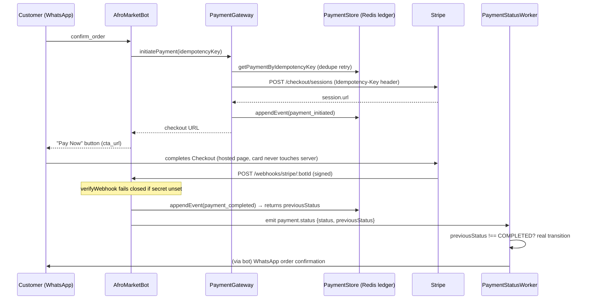
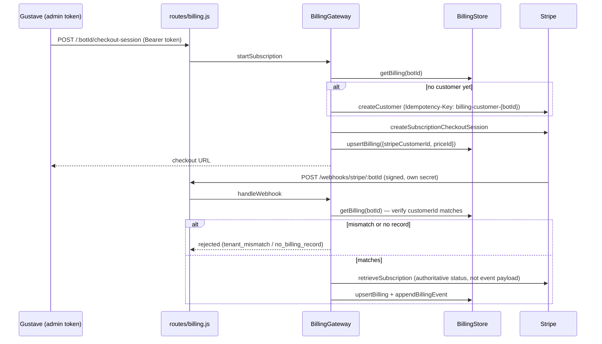

# System Design: Stripe Payment Architecture — BotManagerService

**Companion to:** `system_design_payment_gateway.md` — a whiteboard-design writeup for `PaymentManagementService`/CamPay/MTN MoMo/Orange Money, from a separate design session and not currently tracked in this repository (referenced here for context; not a repo-internal link). That document distills 6 principles from V1→V4 of a payment design exercise. This document audits BotManagerService's actual Stripe code against those same 6 principles, documents a real incident found and fixed while doing that audit, and lists what's still open.

Unlike the companion doc, this one is not a translation exercise — BotManagerService's Stripe integration is a real, running implementation, tested end-to-end against the Stripe sandbox and over live WhatsApp on 2026-08-02. The audit below is against what the code actually does, not what a whiteboard says it should do.

---

## 1. Two distinct money flows, two separate subsystems

| | Consumer payments (`core/payments/`) | B2B billing (`core/billing/`) |
|---|---|---|
| **Who pays whom** | End customer → platform (merchant of record), one-time | Bot Management Service's own SMB clients → platform, recurring |
| **Stripe primitive** | Checkout Session, `mode: payment` | Customer + Checkout Session (`mode: subscription`) + Billing Portal |
| **Also supports** | CamPay (mobile money), MTN MoMo (stub) | Stripe only |
| **Webhook endpoint** | `POST /api/payments/webhooks/stripe/:botId` (`checkout.session.*`) | `POST /api/billing/webhooks/stripe/:botId` (`customer.subscription.*`, `invoice.*`) — separate Stripe Dashboard endpoint, separate signing secret |
| **State store** | `PaymentStore` (Redis, 24h TTL, per-transaction ledger) | `BillingStore` (Redis, no TTL — a subscription is a standing relationship) |
| **Reused by** | AfroMarket (Stripe), ThomasNetwork (CamPay) | Any bot/client (`botId`-scoped) |

Both subsystems share the same underlying patterns (idempotency, ledger, webhook verification) — evaluated separately below because they diverged slightly during independent development, and one gap (§4) was specific to the consumer-payments side.

---

## 2. Current architecture (as verified 2026-08-02)

---

## 3. Design principles checklist

Scoring against the 6 principles from the companion doc's §7.

| # | Principle | Consumer payments | B2B billing |
|---|---|---|---|
| 1 | **Idempotency key, client-generated, checked server-first** | ✅ `PaymentGateway.initiatePayment` checks `getPaymentByIdempotencyKey` before calling Stripe; key also forwarded as Stripe's own `Idempotency-Key` header (defense in depth — dedupes even if the local check races). Bot-side key is generated once at `checkout_review` and reused on retry (tested: double-tap doesn't create a second Stripe session). | ✅ `createCustomer` uses a stable `billing-customer-{botId}` key so two racing "start subscription" calls collapse into one Stripe Customer at Stripe's own API level, not just via a local lock. |
| 2 | **Card data never touches the server (PCI)** | ✅ Stripe **Checkout Session**, hosted page — card entered on `checkout.stripe.com`, never in a BotManagerService request body. | ✅ Same — subscription Checkout Session is also hosted. |
| 3 | **Async by nature — never block on settlement** | ✅ Webhook is primary path; `PaymentStatusWorker` polls in the background (10s interval, 10min timeout) as a fallback if the webhook never arrives — no request thread ever waits on Stripe settling. | ✅ Webhook-driven; no polling exists or is needed (subscription state changes are rarer and Stripe always retries webhook delivery). |
| 4 | **State is append-only (immutable ledger)** | ✅ `PaymentStore.appendEvent` — every transition (`payment_initiated`, `payment_completed`, `payment_status_polled`, and now `payment_timed_out`, see §4) is a new entry in `payment_events:{botId}:{transactionId}`; the `payment:{botId}:{transactionId}` row is an explicitly-documented **derived snapshot**, not the source of truth. | ✅ `BillingStore.appendBillingEvent` — same pattern, added during this work specifically because the original billing module only kept a snapshot (see PR review that caught this before it shipped). |
| 5 | **Webhooks are the source of truth but untrusted until proven otherwise** | ✅ Signature verified, **fails closed** if `STRIPE_WEBHOOK_SECRET` unset (rejects rather than silently accepting). Event ID deduped via `appendEvent`'s `setnx` before any state changes. | ✅ Same fail-closed signature check (separate secret, separate endpoint) **plus an extra check consumer-payments doesn't need**: `handleWebhook` verifies the event's `customerId` actually matches the `botId`'s billing record before applying anything — a valid signature only proves the payload came from Stripe, not that it belongs to this tenant. |
| 6 | **Current status is a read-model derived from the ledger, not a field written to directly** | ⚠️ **Was violated** until 2026-08-02 (see §4) — not in the ledger-write itself, but in how a *consumer* of the ledger (`PaymentStatusWorker`) re-derived "previous status" by re-reading the snapshot the same request had already updated. Fixed; see below. | ✅ Correct from initial implementation — `handleWebhook` always re-fetches authoritative status via `retrieveSubscription` rather than trusting either the event payload or a locally-cached "previous" value. |

**Net assessment: strong.** 5 of 6 principles were correctly implemented from the start on the consumer-payments side; the one gap was subtle (an ordering bug, not a missing feature) and has been fixed and regression-tested. Billing was designed after seeing this pattern once already and avoided the mistake by construction (fetch-authoritative-state instead of trust-the-event).

---

## 4. Incident: `payment.completed` never fired (found & fixed 2026-08-02)

**Symptom, discovered during live WhatsApp testing:** a real customer paid successfully via Stripe Checkout (webhook delivered, signature verified, ledger correctly showed `COMPLETED`) — and never received the WhatsApp order confirmation. No error was logged anywhere.

**Root cause:** both the webhook route and the polling path call `store.appendEvent(...)` — which writes the *new* status into the payment snapshot — **before** emitting `'payment.status'`. `PaymentStatusWorker._onStatus` detected a "real transition" by comparing the incoming status against `payment.status` re-read from that same snapshot. But by the time `_onStatus` ran, the snapshot already held the new status (the emitter's own prior write), so `previousStatus === status` was always true. Every genuine transition looked like "no change," `payment.completed`/`payment.failed` never fired, and nothing downstream (WhatsApp confirmation, `MachineStateService` notification, any future listener) ever ran — silently, for every successful and failed payment, since this shipped.

This is exactly principle 6 above, violated one level removed: the ledger write was correct, but a *consumer* of the ledger re-derived state by re-reading storage instead of trusting the transition the write itself already knew about.

**Fix:** `PaymentStore.appendEvent` now returns the pre-write `previousStatus` alongside its existing return value. Every emitter of `'payment.status'` (webhook routes, `PaymentGateway.checkStatus`, the timeout handler) now carries that true previous status on the event. `_onStatus` uses `evt.previousStatus` instead of re-deriving it from storage.

**Verified two ways:**
1. **Unit regression tests** (`test/paymentStatusWorker.test.js`) replicate the exact broken call order using the *real* `PaymentGateway`/`PaymentStore` (not fakes) — confirmed failing before the fix, passing after.
2. **Two full live runs**, WhatsApp → real Stripe sandbox Checkout → real webhook → real confirmation message received on a real phone, for two different orders (`AM-W1PKX1HYV`, `AM-ITGD8UEMX`).

**Related gap found during the same audit and fixed alongside it:** `PaymentStatusWorker._handleTimeout` (a payment that never resolves within `PAYMENT_TIMEOUT_MS`) wrote `FAILED` via `store.upsertPayment` directly, bypassing `appendEvent` entirely — meaning a timed-out payment changed status with **zero ledger entry** explaining why. Now uses `appendEvent` with `eventType: 'payment_timed_out'`, same as every other transition.

**Latent race introduced as a side effect of the fix, caught by code review before merge:** the old (buggy) code's re-read of live store state at consumption time accidentally self-deduplicated a webhook and a poll racing on the same transaction — whichever handler ran second would see the already-updated status and treat itself as "no change." Trusting `evt.previousStatus` (the fix) removes that accidental guard: if a webhook and a poll tick land close enough together, both can independently read the same stale prior status and both conclude "real transition," double-firing `payment.completed`/`payment.failed`. **Currently mitigated, not eliminated:** both existing listeners (`AfroMarketBot._onPaymentCompleted`, `MachineService._onPaymentCompleted`) already hold their own Redis `setnx` lock before acting, so no customer-visible double-send is likely today — but `PaymentStatusWorker` itself has no protection against double-emitting the higher-level event, and any future listener added without its own lock inherits the risk silently. Tracked as gap #5 below rather than fixed now — the correct fix (an atomic "claim this transition" step inside `appendEvent`, or a final live-status check immediately before emit) is a real design decision, not a one-line patch, and doesn't block this incident's actual fix.

---

## 5. Remaining gaps / recommendations, ranked

1. **CamPay's webhook signature verification is opt-in, not fail-closed** (`routes/payments.js`, `/webhooks/campay/:botId`) — only enforced when `CAMPAY_WEBHOOK_SECRET` is set; if unset, the endpoint accepts unverified payloads as if they were genuine. This is the exact failure mode the companion document calls "the highest-severity item ... if it's missing" for `PaymentManagementService`, and the same weakness exists here for ThomasNetworkBot's CamPay flow. Stripe's own webhook path does not have this problem (fails closed unconditionally). **Recommendation: make CamPay fail closed too, or explicitly document why it's intentionally different (e.g. CamPay webhook payloads always signed by convention in this account, hard requirement never absent).** Not fixed in this pass — out of the Stripe-specific scope of this session, flagging per the companion doc's own standard of not letting a known gap go unrecorded.

2. **`appendEvent`'s ledger entries don't carry arbitrary `rest` fields** — e.g. `failureReason` lands in the derived snapshot (via spread) but not in the individual ledger event object pushed to the `payment_events` list. Minor: the *current* state is always correct, but reconstructing "why did this fail" purely from ledger history requires cross-referencing the snapshot's last-known `failureReason`, not just replaying events. Low priority — no observed incident from this, unlike §4.

3. **No idempotency key on the billing `createSubscriptionCheckoutSession` call itself** (only `createCustomer` has one) — two racing "start subscription" requests for a bot with no customer yet will create two Checkout Sessions (harmless: only one gets paid, the other expires), but this is asymmetric with the consumer-payments side, which threads `idempotencyKey` through the entire `initiatePayment` call. Low priority given the admin-only, low-volume nature of billing session creation (§ from the earlier code review: rate-limited, bearer-token-gated).

4. **Stripe Tax was never modeled** (flagged in an earlier planning pass) — `automatic_tax` is not enabled on either Checkout Session type. Not a correctness bug (Stripe won't calculate/collect tax it isn't asked to), but worth a deliberate decision once any EU/US paying clients are onboarded to the B2B billing side, per the earlier Stripe implementation-planner findings.

5. **`PaymentStatusWorker` can double-emit `payment.completed`/`payment.failed` if a webhook and a poll tick race on the same transaction** — see the incident writeup above for the mechanism. Mitigated today by per-listener idempotency locks, not eliminated at the source. **Recommendation:** make `appendEvent` (or a thin wrapper around it) atomically claim the transition — e.g. only the caller whose write actually flips the status gets `shouldEmit: true` back — instead of relying on every downstream listener to independently protect itself.

6. **Billing's `priceId` is recorded optimistically at Checkout Session creation, before the customer ever completes payment** (`BillingGateway.startSubscription`) — unlike `stripeSubscriptionId`/`status`, which are only ever written from the webhook-confirmed path, an abandoned checkout leaves a stale `priceId` in the store indefinitely with no correction mechanism. Low blast radius today (nothing else reads it yet), but will silently mislead the first thing that does (dashboard, support tooling). Not fixed in this pass.

None of these are "mine with the pin still in" (the companion doc's phrase for W4/W5) — #1 is the closest, and it's scoped to CamPay/ThomasNetwork, not Stripe/AfroMarket. #5 and #6 are billing-side findings from the same review pass that produced this document, included here for one canonical gap list rather than splitting it across two docs.

**Fixed in this pass, not just flagged:** `BillingGateway.startSubscription` now refuses to start a second subscription for a `botId` that already has one in a non-terminal state (`ACTIVE`/`TRIALING`/`PAST_DUE`/etc.) — the earlier version only avoided recreating the Stripe *Customer*, not the *Subscription*, so a retried or duplicated call could have created a second real, separately-billed subscription that this store can't even represent (one `stripeSubscriptionId`/`status` pair per bot). Also: webhook rejections (`tenant_mismatch`, `no_billing_record`) now log at `error` level instead of `warn` — the route still returns Stripe a 200 either way, so that log line was the only signal a misrouted or tenant-crossed event ever existed.

---

## 6. Test coverage backing this document

- `test/paymentGateway.test.js`, `test/payments.test.js`, `test/paymentStatusWorker.test.js`, `test/stripeProvider.test.js` — consumer-payments unit coverage, including the new `previousStatus`-propagation regression test using the real `PaymentGateway`.
- `test/billingProvider.test.js`, `test/billingStore.test.js`, `test/billingGateway.test.js`, `test/billingRoutes.test.js`, `test/billingTypes.test.js` — billing unit + route-level coverage, including tenant-mismatch rejection and idempotency-key forwarding.
- Full suite: 177 tests, 0 failures, as of this document.
- Live verification (not unit tests, cannot be automated without a Stripe-hosted-page browser driver): two complete WhatsApp → Stripe Checkout → webhook → confirmation-message round trips against the real Stripe sandbox, 2026-08-02.
