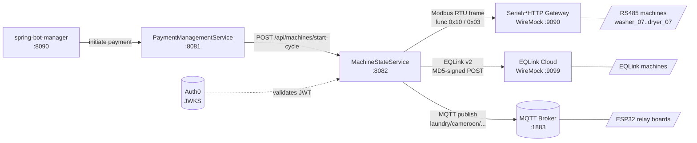
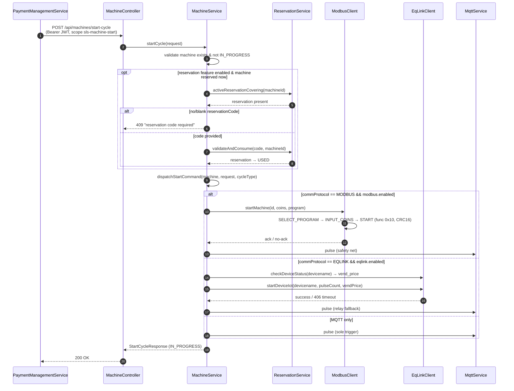
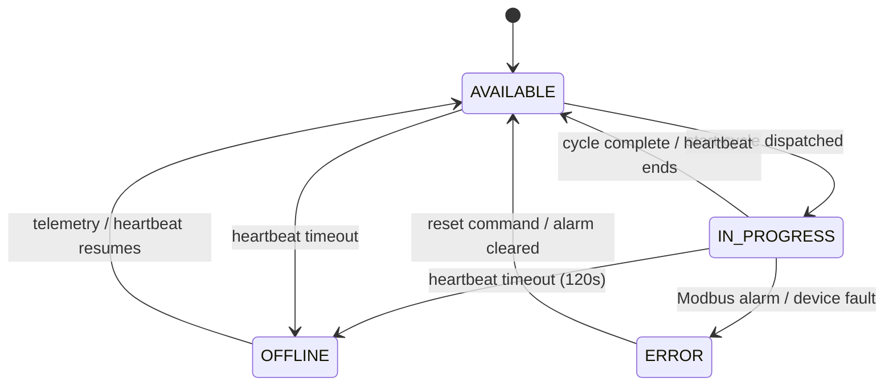
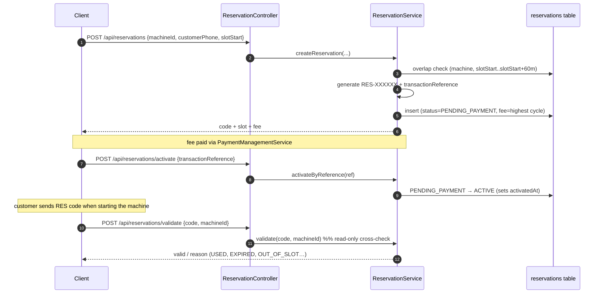
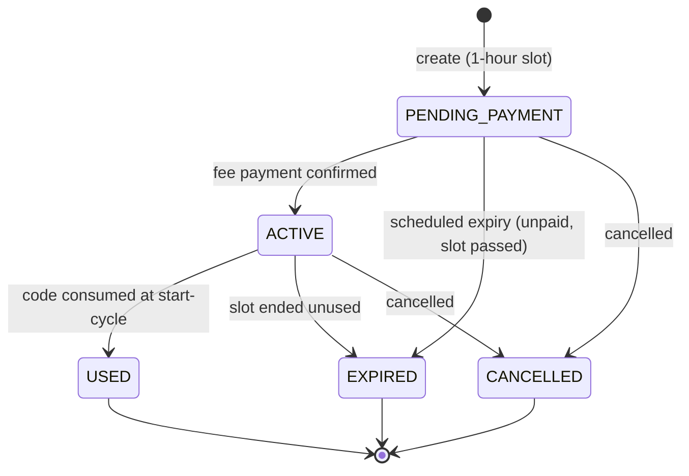

# MachineStateService — Communication Flow

Port **8082** · OAuth2 Resource Server (Auth0 JWT) · H2 (dev) / PostgreSQL (prod)

MachineStateService is the **machine-control hub**. It receives a `start-cycle` request
(usually from PaymentManagementService after a successful payment) and decides *how* to
physically start the machine: **Modbus RTU**, **EQLink Open API v2**, or **MQTT** — always
firing an MQTT pulse as a safety net. It also owns the **reservation** mechanism.

---

## 1. System context

| Channel | Machines | Transport | Auth |
|---------|----------|-----------|------|
| **Modbus RTU** | `washer_07–09`, `dryer_05–07` | HTTP→serial gateway, function 0x10 write / 0x03 read, CRC16 | none (CRC16 per frame) |
| **EQLink v2** | mapped via `eqlink.device-name-mapping` | HTTPS POST, MD5 signature | `sign = MD5(sorted_params + "&secret_key=…")` |
| **MQTT** | all (safety net) | Eclipse Paho, topic `laundry/cameroon/…` | broker user/pass |

Feature flags (`application.yml`): `modbus.enabled`, `features.reservation-enabled`,
`eqlink.enabled` — all default **false** (MQTT-only fallback).

---

## 2. Start-cycle sequence (protocol selection)

**Key rule:** the MQTT pulse is *always* sent — it is the primary trigger when no other
protocol is enabled, and a local-relay fallback when Modbus/EQLink is the primary.

---

## 3. Machine state diagram

A scheduled job (`machine.cycle-check-interval-ms`) reconciles cycle completion;
`machine.heartbeat-timeout-seconds` marks silent machines OFFLINE.

---

## 4. Reservation lifecycle

A reservation holds a machine for **exactly one hour**. The fee equals the price of the
highest wash cycle (kept in sync with the bot's long cycle). It is charged *in addition* to
the normal wash price. Authorization is by **code + machine — never by user** (a customer
may reserve on someone else's behalf).

A `@Scheduled` job (`reservation.expiry-check-ms`) moves overdue rows to EXPIRED.

---

## 5. Modbus RTU framing

Register map: **SX174003A communication protocol**. PLC address → wire address is `PLC − 1`.

| Operation | Register (PLC) | Function |
|-----------|----------------|----------|
| Select program | 4X1150 (`0x047D`) | 0x10 write |
| Input coins | 4X1149 (`0x047C`) | 0x10 write |
| Start | 4X1146 (`0x0479`) | 0x10 write |
| Forced stop | `0x047B` | 0x10 write |
| Reset alarm | `0x0478` | 0x10 write |
| Read monitor (20 regs) | `0x048C` | 0x03 read |
| Read alarm I/O (7 regs) | `0x04B4` | 0x03 read |

Start sequence: **select-program → input-coins → start**. Each frame is protected by
CRC16 (poly `0xA001`, init `0xFFFF`, appended low-byte-first). In dev the serial bus is
emulated by WireMock (`modbus-mock/`, port 9090) — see `modbus-mock/README.md`.

---

## 6. Endpoint → scope map

| Method | Path | Scope |
|--------|------|-------|
| GET | `/api/machines/**` | `sls-machine-read` |
| POST | `/api/machines/start-cycle` | `sls-machine-start` |
| POST | `/api/machines/{id}/command/**` | `sls-machine-command` |
| POST | `/api/esp32/telemetry` | `sls-telemetry-write` |
| POST | `/api/reservations`, `/activate` | `sls-reservation-write` |
| POST | `/api/reservations/validate`, GET `/api/reservations/**` | `sls-reservation-read` |

Public: `/swagger-ui/**`, `/v3/api-docs/**`, `/h2-console/**`, `/actuator/health`.
