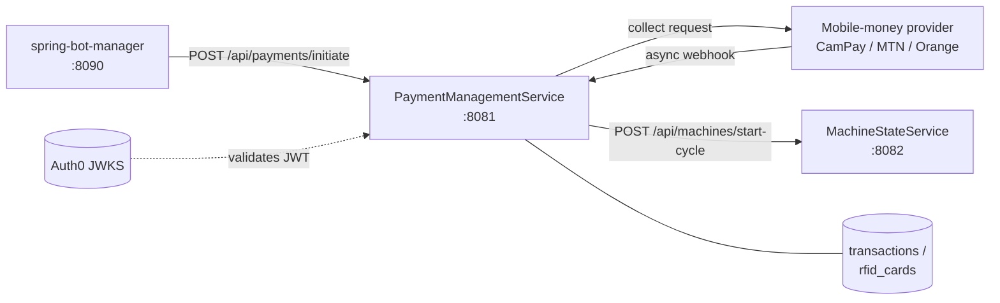
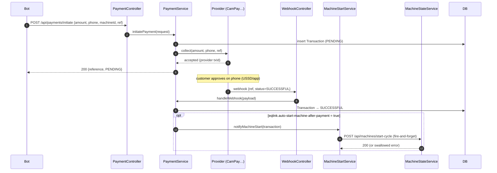
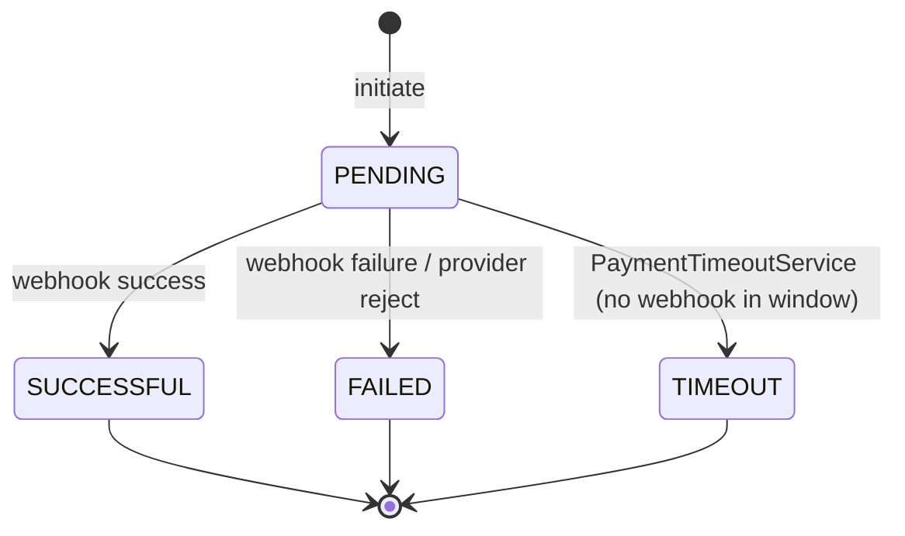
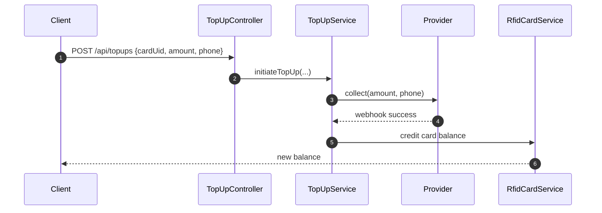
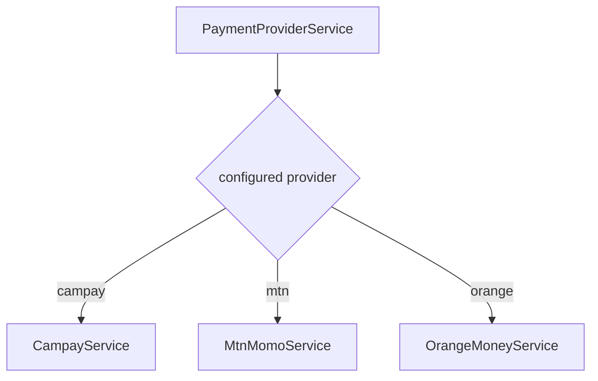

# PaymentManagementService — Communication Flow

Port **8081** · OAuth2 Resource Server (Auth0 JWT) · H2 (dev) / PostgreSQL (prod)

PaymentManagementService owns **money movement and RFID balances**. It initiates mobile-money
collections (CamPay / MTN MoMo / Orange Money), tracks transaction state, receives provider
webhooks, and — on success — notifies **MachineStateService** to start the machine.

---

## 1. System context

The provider is chosen at runtime (`PaymentProviderService`). RFID top-ups credit a stored
balance instead of starting a machine.

---

## 2. Pay-then-start sequence

`MachineStartService.notifyMachineStart` is **fire-and-forget**: a failure to reach
MachineStateService does *not* roll back the payment record — the bot/ESP32 fallback or an
operator handles it.

---

## 3. Transaction state diagram

`PaymentTimeoutService` (scheduled) closes transactions stuck in PENDING past the timeout.

---

## 4. RFID top-up

A subsequent wash can be paid from the RFID balance instead of a fresh mobile-money collection.

---

## 5. Provider abstraction

All providers implement the same collect/verify contract, so `PaymentService` and the webhook
handler stay provider-agnostic.
