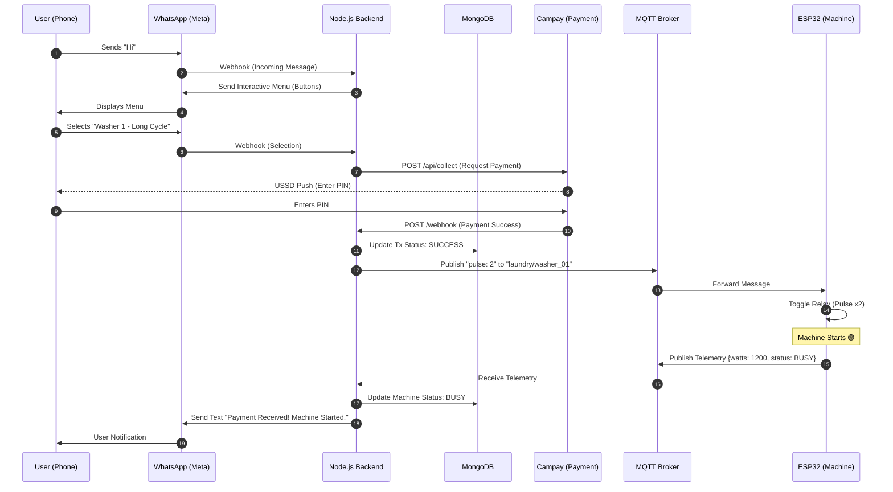

# Smart Laundromat Control System - Backend

[](https://github.com/YOUR_USERNAME/YOUR_REPO/actions/workflows/pull-request.yml)
[](https://github.com/YOUR_USERNAME/YOUR_REPO/actions/workflows/deploy-test.yml)
[](https://github.com/YOUR_USERNAME/YOUR_REPO/releases)

This repository contains the Node.js backend service for the Smart Laundromat Control System. It handles payment processing, real-time machine control via MQTT, and user interactions through WhatsApp.

## Quick Start

**New to this project? Start here:**

1. **Complete Setup Guide**: [SETUP-GUIDE.md](SETUP-GUIDE.md) - End-to-end setup instructions
2. **Docker Guide**: [DOCKER.md](DOCKER.md) - Containerization and local development
3. **CI/CD Pipeline**: [CI-CD.md](CI-CD.md) - Automated deployment pipeline
4. **Configuration**: [CONFIGURATION.md](CONFIGURATION.md) - Environment variables and security

**Already set up?**
```bash
# Start everything with Docker
docker-compose up

# Start ngrok (new terminal)
ngrok http 3000

# Test WhatsApp bot - Send "Hi" to your test number
```

## Table of Contents

- [Quick Start](#quick-start)
- [Features](#features)
- [Tech Stack](#tech-stack)
- [Getting Started](#getting-started)
  - [Prerequisites](#prerequisites)
  - [Installation](#installation)
- [Running the Application](#running-the-application)
- [API Endpoints](#api-endpoints)
- [Environment Variables](#environment-variables)
- [CI/CD Pipeline & Deployment](#cicd-pipeline--deployment)
- [Documentation](#documentation)

## Features

- **Payment Processing**: Integrates with Campay and MTN MoMo to handle mobile money payments.
- **Real-time Machine Control**: Uses MQTT to send commands (e.g., start cycle) to laundry machines.
- **WhatsApp Integration**: Interactive WhatsApp bot with button menus for user interaction.
- **Multi-language Support**: Full English and French localization for all bot messages.
- **Webhook Support**: Robust webhook handlers for receiving notifications from Campay, MTN, and Meta (WhatsApp).
- **Automatic Notifications**: Users receive WhatsApp messages when payment is confirmed and when their laundry is ready.
- **Cycle Monitoring**: Background service tracks wash cycles and notifies users when complete.
- **Customer Feedback**: 5-star rating system sent 30 minutes after cycle completion, with staff alerts for low ratings.
- **Race Condition Protection**: Machine reservation system prevents double-booking during payment processing.

## Tech Stack

- **Runtime**: Node.js
- **Framework**: Express.js
- **Database**: MongoDB with Mongoose
- **Real-time Communication**: MQTT.js
- **HTTP Client**: Axios
- **Testing**: Jest & Supertest
- **CI/CD**: GitHub Actions

## System Architecture

This diagram shows how the Physical Layer (Shop) interacts with the Cloud Layer via the Node.js Backend, following a C4-inspired Container Diagram approach.

```mermaid
graph TD
    %% EXTERNAL ACTORS & SERVICES
    UserMobile[("User (Mobile Phone)")]
    WhatsAppAPI[("Meta/WhatsApp API")]
    CampayAPI[("Campay Payment Gateway")]
    
    %% THE CLOUD INFRASTRUCTURE (VPS)
    subgraph Cloud_Infrastructure ["Cloud Backend (VPS - DigitalOcean/Heroku)"]
        style Cloud_Infrastructure fill:#e1f5fe,stroke:#01579b
        
        NodeServer["Node.js Backend<br/>(Express + Logic)"]
        MongoDB[("MongoDB<br/>(Users, Tx, Logs)")]
        MQTTBroker["MQTT Broker<br/>(Mosquitto/HiveMQ)"]
        
        NodeServer <-->|"Mongoose (TCP)"| MongoDB
        NodeServer <-->|"Pub/Sub (TCP)"| MQTTBroker
    end

    %% THE PHYSICAL SHOP (CAMEROON)
    subgraph Physical_Shop ["Laundromat Shop (Douala/Yaoundé)"]
        style Physical_Shop fill:#fff3e0,stroke:#e65100
        
        Router["4G LTE Router<br/>(Gateway)"]
        Kiosk["Tablet Kiosk<br/>(Web App)"]
        
        subgraph Machine_Stack ["LG Giant C+ Stack"]
            ESP32["ESP32 Controller"]
            Relay["5V Relay"]
            Sensor["PZEM-004T"]
            LG_PCB["LG Mainboard"]
            
            ESP32 -->|"GPIO/Pulse"| Relay
            Relay -->|"Close Circuit"| LG_PCB
            Sensor -->|"UART (Read Power)"| ESP32
            Sensor -.- >|"Clamp"| LG_PCB
        end
    end

    %% CONNECTIONS
    UserMobile <-->|"WhatsApp Chat"| WhatsAppAPI
    UserMobile <-->|"USSD Payment"| CampayAPI
    
    WhatsAppAPI -->|"Webhook (HTTPS)"| NodeServer
    NodeServer -->|"Send Message (HTTPS)"| WhatsAppAPI
    
    NodeServer -->|"Request Pay (HTTPS)"| CampayAPI
    CampayAPI -->|"Webhook (HTTPS)"| NodeServer
    
    Kiosk <-->|"HTTP/REST"| NodeServer
    
    ESP32 <-->|"MQTT (TCP/TLS)"| MQTTBroker
    
    %% Network Tunnel
    Router -.- >|"Internet Connection"| MQTTBroker
```

### Architecture Key Takeaways:

The Decoupling: The Shop and the Cloud are loosely coupled via MQTT. If the internet cuts, the machine finishes its current cycle safely (Firmware logic), and the Backend queues messages (QoS 1).
The Hub: The Node.js Backend is the "Traffic Controller". It translates HTTP Webhooks (from Campay/WhatsApp) into MQTT Commands (for ESP32).
The Edge: The ESP32 is "dumb" regarding business logic (it doesn't know prices), but "smart" regarding hardware (it handles the pulses and power reading).

## Sequence Diagram (The Payment-to-Wash Flow)

This diagram illustrates the Sprint 3 logic: From a "Hi" on WhatsApp to the machine actually starting.


## Component Design Details

### A. The Edge Node (ESP32)

Role: Protocol Converter (MQTT <-> Physical GPIO).
Connectivity: Connects to the Shop's 4G Router.
Security: Uses MQTTS (TLS) if possible, or standard MQTT with Username/Password auth.
Failsafe: If Wi-Fi is lost, it continues to monitor the PZEM sensor locally. When Wi-Fi returns, it bursts the latest status.

### B. The Backend (Node.js)

API Gateway: Express.js handling port 3000/443.
State Machine: Uses the stateManager.js (Redis/Memory) to track if the user is in the "Menu" stage or "Payment" stage.
Integration Layer: Contains the axios services for Campay and Meta Graph API.

### C. The Message Broker (MQTT)

Why MQTT? It is lightweight. An HTTP request requires a 3-way handshake and headers every time. MQTT keeps a persistent socket open. This saves data on your Cameroonian 4G plan and is faster.
Topic Structure:
laundry/cameroon/{shop_id}/{machine_id}/command (Subscribe) -> For Pulses.
laundry/cameroon/{shop_id}/{machine_id}/telemetry (Publish) -> For Watts/Status.

## Getting Started

Follow these instructions to get a local copy of the project up and running for development and testing purposes.

### Prerequisites

**Option 1: Docker (Recommended)**
- [Docker Desktop](https://www.docker.com/products/docker-desktop/) (includes Docker and Docker Compose)
- That's it! MongoDB and MQTT broker are included in the containers.

**Option 2: Manual Setup**
- Node.js (v18 or later)
- npm
- A running MongoDB instance
- An MQTT broker (or use public test.mosquitto.org)

### Installation

#### Option 1: Docker Setup (Recommended)

1.  **Clone the repository:**
    ```sh
    git clone https://github.com/YOUR_USERNAME/YOUR_REPO.git
    cd SmartLaundromatControlSystem
    ```

2.  **Set up environment variables:**
    Create a `.env` file in the root directory by copying the example file:
    ```sh
    cp .env.example .env
    ```
    Then fill in your credentials (see [Environment Variables](#environment-variables) section).

3.  **Start all services with Docker Compose:**
    ```sh
    docker-compose up
    ```

    This single command will:
    - ✅ Start MongoDB on port 27017
    - ✅ Start MQTT broker (Mosquitto) on ports 1883 (MQTT) and 9001 (WebSockets)
    - ✅ Start the Node.js backend on port 3000 with hot-reload
    - ✅ Automatically connect all services together
    - ✅ Create persistent volumes for your database

4.  **Verify everything is running:**
    ```sh
    docker ps
    ```
    You should see three containers: `laundry-backend`, `laundry-mongodb`, and `laundry-mqtt`.

5.  **View logs:**
    ```sh
    # All services
    docker-compose logs -f

    # Specific service
    docker-compose logs -f backend
    ```

#### Option 2: Manual Setup

1.  **Clone the repository:**
    ```sh
    git clone https://github.com/YOUR_USERNAME/YOUR_REPO.git
    cd SmartLaundromatControlSystem
    ```

2.  **Install dependencies:**
    ```sh
    npm install
    ```

3.  **Set up environment variables:**
    Create a `.env` file in the root directory by copying the example file, then fill in your credentials.
    ```sh
    cp .env.example .env
    ```

4.  **Ensure MongoDB and MQTT broker are running** on your machine.

## Running the Application

### Docker (Recommended)

**Development mode (with hot-reload):**
```sh
docker-compose up
```

**Stop all services:**
```sh
docker-compose down
```

**Rebuild after dependency changes:**
```sh
docker-compose up --build
```

**Run in background (detached mode):**
```sh
docker-compose up -d
```

**Stop and remove all data (including database volumes):**
```sh
docker-compose down -v
```

### Manual Setup

**Development mode (with hot-reload):**
```sh
npm run dev
```

**Production mode:**
```sh
npm start
```

### Testing

**With Docker:**
```sh
# Run tests in a temporary container
docker-compose run --rm backend npm test
```

**Manual:**
```sh
npm test
```

## API Endpoints

The following are the primary endpoints exposed by the service:

- `POST /api/pay`: Initiates a payment request for a specific machine and cycle type.
- `POST /api/webhook/campay`: Receives payment status notifications from Campay.
- `GET /api/webhook/whatsapp`: Used by Meta for WhatsApp webhook verification.
- `POST /api/webhook/whatsapp`: Receives incoming message notifications from WhatsApp.

## How to Test (Sprint 3 - WhatsApp Flow)

### Testing with Docker + ngrok (Recommended)

1.  **Set Up Campay Sandbox**
    - Create an account at [https://demo.campay.net](https://demo.campay.net)
    - Get your **App Username** and **App Password** from the dashboard
    - Update your `.env` file with these credentials

2.  **Start All Services with Docker**
    ```bash
    docker-compose up
    ```
    Wait until you see:
    ```
    laundry-backend  | Server running on port 3000
    laundry-backend  | ✅ MongoDB connected
    laundry-backend  | ✅ MQTT connected
    ```

3.  **Expose Your Local Server (New Terminal)**
    Since Meta's servers need to send webhooks to your Docker container, you must expose your local port to the internet. Use `ngrok` for this.
    ```bash
    ngrok http 3000
    ```
    Copy the `https://` URL provided by ngrok (e.g., `https://abc123.ngrok.io`).

    **Note**: ngrok works seamlessly with Docker because Docker exposes port 3000 to your host machine at `localhost:3000`, which ngrok tunnels to the internet.

4.  **Configure Meta Webhook**
    - Go to your **Meta App Dashboard** -> **WhatsApp** -> **Configuration**.
    - Click "Edit" on the Callback URL section.
    - **Callback URL**: Paste your ngrok URL and append the webhook path: `https://abc123.ngrok.io/api/webhook/whatsapp`
    - **Verify Token**: Enter the same secret token you have in your `.env` file for `WHATSAPP_VERIFY_TOKEN`.
    - Click **"Verify and Save"**.
    - **Subscribe to webhook fields**: Make sure `messages` is checked

5.  **Send a Message**
    - Open WhatsApp and send a message to the Test Number provided by Meta.
    - Start the conversation by typing: `Hi`

6.  **Follow The Flow**
    - The bot should reply with interactive buttons.
    - Select "Start a Wash" -> Select "Washer 1 (Available)" -> Select "30 Mins (1000 XAF)".
    - **Note**: Payment will only work with **MTN or Orange mobile money numbers** in Cameroon.
    - **Result**: You should receive a Campay USSD prompt on your phone to complete the payment.

7.  **Monitor Logs**
    In your Docker terminal, you'll see real-time logs:
    ```bash
    docker-compose logs -f backend
    ```

### Testing Without Docker (Manual Setup)

1.  **Set Up Campay Sandbox** (same as above)

2.  **Ensure MongoDB and MQTT broker are running** on your machine

3.  **Start the Backend Server**
    ```bash
    npm run dev
    ```

4.  **Expose Your Local Server** (same as step 3 above with ngrok)

5.  **Configure Meta Webhook** (same as step 4 above)

6.  **Test the flow** (same as steps 5-6 above)

## Engineer's Notes for Production

Before deploying to a live environment, consider the following critical points:

*   **Token Expiry**: The "Temporary Access Token" provided by Meta for testing expires every 24 hours. For a production application, you must generate a **Permanent Token**. This is typically done by creating a System User in the Facebook Business Manager and granting it the necessary permissions.

*   **Session Storage**: The current in-memory `sessions = {}` object in `stateManager.js` is not suitable for production. If your Node.js server restarts (which it will due to deployments, crashes, or scaling), you will lose the state of all active user conversations. This must be replaced with a persistent external store like **Redis** or a database.

*   **Idempotency**: Distributed systems like WhatsApp can sometimes send the same webhook notification more than once. To prevent duplicate processing (e.g., sending two "Welcome" messages), you should store the unique `message.id` from the WhatsApp payload in a short-lived cache (like Redis) or a database. Before processing any message, check if its ID has already been seen.

## Environment Configuration

This application uses **environment-specific configuration** to support multiple deployment environments (development, test, stage, production). All sensitive values and business logic parameters (pricing, machine IDs, API URLs) are externalized from the code.

### Quick Start

1. **Copy the example file:**
   ```bash
   cp .env.example .env
   ```

2. **Fill in your credentials** (see below for where to get them)

3. **Start the server:**
   ```bash
   npm run dev
   ```

### Environment Variables Overview

| Variable                | Description                                         | Required |
| ----------------------- | --------------------------------------------------- | -------- |
| `NODE_ENV`              | Environment type: development, test, stage, production | Yes |
| `PORT`                  | The port the server will run on                     | Yes |
| `MONGO_URI`             | Connection string for the MongoDB database          | Yes |
| `MQTT_BROKER_URL`       | URL of the MQTT broker                              | Yes |
| `CAMPAY_APP_KEY`        | Your Campay application username/key                | Yes |
| `CAMPAY_APP_SECRET`     | Your Campay application password/secret             | Yes |
| `WHATSAPP_TOKEN`        | Meta access token for the WhatsApp API              | Yes |
| `WHATSAPP_PHONE_ID`     | The Phone Number ID for your WhatsApp Business App  | Yes |
| `WHATSAPP_VERIFY_TOKEN` | A secret token used to verify the WhatsApp webhook  | Yes |
| `STAFF_ALERT_PHONE`     | WhatsApp number for low rating alerts (e.g., 237xxxxxxxxx) | No |
| `PRICE_SHORT_CYCLE`     | Price for 30-min wash cycle (in XAF)               | No (default: 1000) |
| `PRICE_LONG_CYCLE`      | Price for 60-min wash cycle (in XAF)               | No (default: 2000) |
| `MACHINE_IDS`           | Comma-separated list of machine IDs                 | No (default: washer_01,washer_02) |

**For complete configuration documentation, see [CONFIGURATION.md](CONFIGURATION.md)**

## CI/CD Pipeline & Deployment

This project uses **GitHub Actions** with **Docker** for automated testing and deployment.

### Quick Start

**Want to deploy?**
- **TEST**: Merge PR to `develop` (automatic)
- **STAGE**: Manual trigger via GitHub Actions
- **PRODUCTION**: Create GitHub Release with tag `vX.Y.Z`

**For complete CI/CD documentation, see [CI-CD.md](CI-CD.md)**

### Deployment Environments

| Environment | URL | Trigger | Purpose |
|-------------|-----|---------|---------|
| TEST | https://smartlaundry-test.herokuapp.com | Auto (merge to develop) | Integration testing |
| STAGE | https://smartlaundry-stage.herokuapp.com | Manual | UAT, demos |
| PRODUCTION | https://smartlaundry.herokuapp.com | GitHub Release | Live system |

### CI/CD Features

✅ **Automated Testing**
- Tests on Node.js 18.x and 20.x
- Docker integration tests
- Security vulnerability scanning
- Automatic PR title formatting

✅ **Continuous Deployment**
- Docker-based deployments to Heroku
- Environment-specific configurations
- Health checks and smoke tests
- Automatic rollback on failure

✅ **Docker Image Registry**
- Multi-platform builds (amd64, arm64)
- Versioned images in GitHub Container Registry
- Build caching for performance

### Workflows

See [.github/workflows/README.md](.github/workflows/README.md) for quick reference.

## Documentation

Comprehensive guides for all aspects of the project:

| Document | Description | Best For |
|----------|-------------|----------|
| [SETUP-GUIDE.md](SETUP-GUIDE.md) | Complete setup from scratch | New team members, first-time setup |
| [DOCKER.md](DOCKER.md) | Docker containerization guide | Local development, understanding containers |
| [CI-CD.md](CI-CD.md) | Complete CI/CD pipeline documentation | DevOps, understanding deployments |
| [CI-CD-SUMMARY.md](CI-CD-SUMMARY.md) | Executive summary of CI/CD | Quick overview, decision makers |
| [CONFIGURATION.md](CONFIGURATION.md) | Environment variables and security | Configuration, secrets management |
| [API.md](API.md) | API endpoints documentation | Frontend developers, API consumers |
| [docs/whatsapp-flow-diagram.md](docs/whatsapp-flow-diagram.md) | WhatsApp bot state machine & flows | Understanding bot conversation logic |
| [.github/workflows/README.md](.github/workflows/README.md) | Quick workflow reference | Daily operations, quick lookup |

**Start here if you're:**
- 🆕 **New to the project**: Read [SETUP-GUIDE.md](SETUP-GUIDE.md) first
- 🐳 **Learning Docker**: Check [DOCKER.md](DOCKER.md)
- 🚀 **Deploying code**: See [CI-CD.md](CI-CD.md)
- ⚙️ **Configuring environments**: Read [CONFIGURATION.md](CONFIGURATION.md)
- 📊 **Making decisions**: Review [CI-CD-SUMMARY.md](CI-CD-SUMMARY.md)

## Legacy CI/CD Pipeline (Old)

This project uses GitHub Actions to automate testing and deployments.

### Branching Strategy

- `develop`: The main integration branch. All feature branches are merged here.
- `feature/*`: Individual branches for new features or bug fixes.

### Deployment Process

1.  **Pull Request**: Opening a PR against `develop` triggers the `PR Quality Check` workflow, which runs all tests.
2.  **TEST Environment**: Merging a PR into `develop` automatically triggers the `Deploy to TEST` workflow.
3.  **STAGE Environment**: The `Deploy to STAGE` workflow can be triggered manually from the GitHub Actions UI to deploy the current `develop` branch to the staging environment for UAT.
4.  **PROD Environment**:
    - Pushing a new tag (e.g., `git tag v1.0.0 && git push origin v1.0.0`) triggers the `Create GitHub Release` workflow. This runs tests, packages the code, and creates a formal release on GitHub.
    - The creation of this new release automatically triggers the `Release to PROD` workflow, which deploys the tagged version to the production environment.