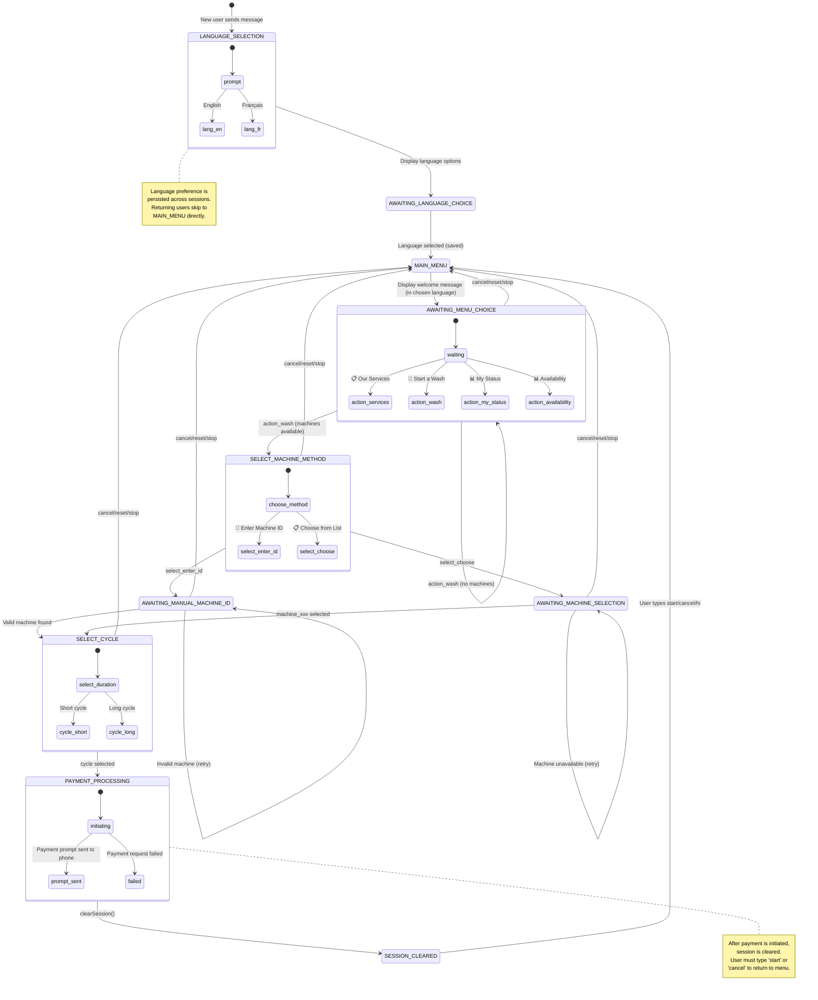
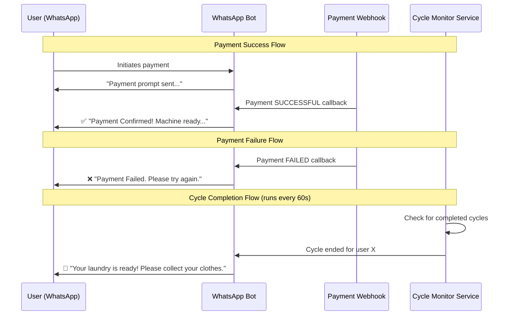
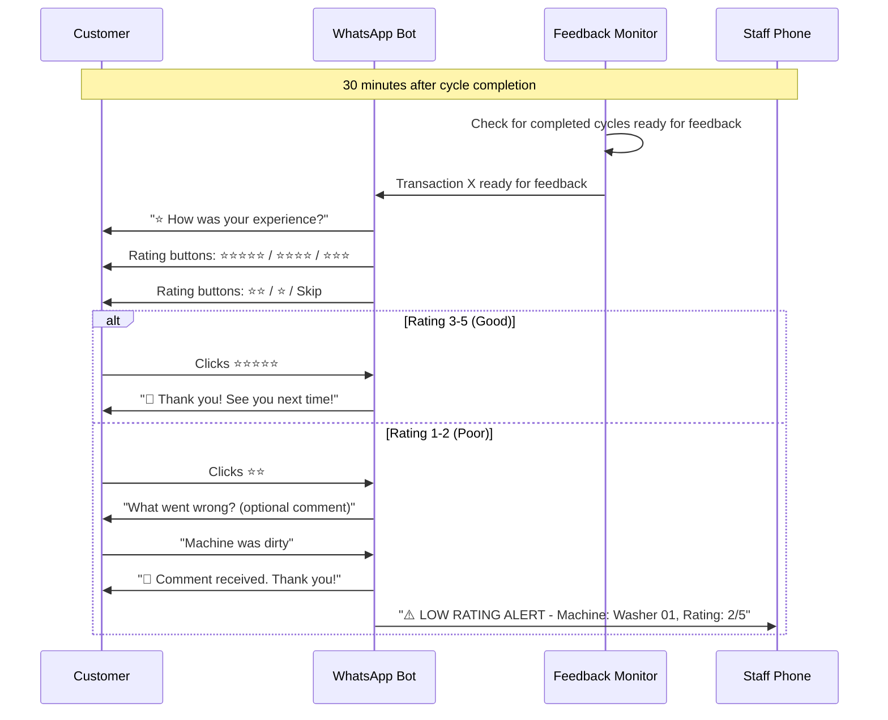

# WhatsApp Bot State Machine Diagram

## State Flow Diagram (Mermaid)



## States Overview

| State | Description | Next States |
|-------|-------------|-------------|
| `LANGUAGE_SELECTION` | First-time users choose language (EN/FR) | → `AWAITING_LANGUAGE_CHOICE` |
| `AWAITING_LANGUAGE_CHOICE` | Waiting for language selection | → `MAIN_MENU` |
| `MAIN_MENU` | Entry point, shows welcome message | → `AWAITING_MENU_CHOICE` |
| `AWAITING_MENU_CHOICE` | User chooses action from menu | → `SELECT_MACHINE_METHOD`, stays in same state |
| `SELECT_MACHINE_METHOD` | User chooses how to select machine | → `AWAITING_MANUAL_MACHINE_ID`, `AWAITING_MACHINE_SELECTION` |
| `AWAITING_MANUAL_MACHINE_ID` | User types machine ID manually | → `SELECT_CYCLE` or retry |
| `AWAITING_MACHINE_SELECTION` | User picks from machine list | → `SELECT_CYCLE` or retry |
| `SELECT_CYCLE` | User chooses wash duration | → Payment processing, then cleared |
| `(cleared)` | Session cleared after payment | → `MAIN_MENU` on next message |

## Global Reset Commands

These commands work from **ANY state** and reset to `MAIN_MENU`:
- `hi`
- `hello`
- `start`
- `reset`
- `cancel`
- `stop`
- `action_cancel` (button)

## Payment Flow Note

```
┌─────────────────────────────────────────────────────────────────┐
│  IMPORTANT: Payment Cancellation                                │
├─────────────────────────────────────────────────────────────────┤
│  When user types "cancel" after payment prompt is sent:         │
│                                                                 │
│  ✅ WhatsApp bot resets to MAIN_MENU                           │
│  ❌ Mobile Money payment request is NOT cancelled              │
│                                                                 │
│  The payment prompt on the user's phone remains active.         │
│  If they approve it, the machine WILL start.                    │
│                                                                 │
│  The transaction stays in PENDING status in MongoDB until:      │
│  - User approves → webhook updates to SUCCESSFUL                │
│  - User declines → webhook updates to FAILED                    │
│  - Timeout → stays PENDING (machine unlocked after 5 minutes)   │
└─────────────────────────────────────────────────────────────────┘
```

## Asynchronous Notifications (Outside State Machine)

These notifications are sent independently of the conversation state, triggered by backend events:



### Notification Messages

| Event | Message (EN) | Message (FR) |
|-------|-------------|--------------|
| Payment Success | ✅ Payment Confirmed! Machine is ready... | ✅ Paiement Confirmé! La machine est prête... |
| Payment Failed | ❌ Payment Failed. Please try again. | ❌ Paiement Échoué. Veuillez réessayer. |
| Cycle Completed | 🎉 Your laundry is ready! | 🎉 Votre linge est prêt! |
| Feedback Request | ⭐ How was your experience? | ⭐ Comment était votre expérience? |

## Customer Feedback System

Feedback is requested 30 minutes after cycle completion to give customers time to collect their laundry.



### Feedback Configuration

| Setting | Value | Description |
|---------|-------|-------------|
| `FEEDBACK_DELAY_MINUTES` | 30 | Time after cycle completion before feedback request |
| `STAFF_ALERT_PHONE` | env variable | Phone number for low rating alerts |
| Low rating threshold | 1-2 stars | Triggers staff alert |

### Feedback Data Model

```javascript
// Added to Transaction schema
feedback: {
    rating: Number,        // 1-5 stars
    comment: String,       // Optional, max 200 chars
    submittedAt: Date,
    staffAlertSent: Boolean
}
feedbackRequestSent: Boolean
feedbackRequestedAt: Date
```

## Race Condition Protection

When two users try to select the same machine simultaneously:

```
┌─────────────────────────────────────────────────────────────────┐
│  Machine Availability Check (getMachinesStatus)                 │
├─────────────────────────────────────────────────────────────────┤
│  A machine is marked UNAVAILABLE if:                            │
│                                                                 │
│  1. cycleStatus = 'IN_PROGRESS' AND cycleEndsAt > now          │
│     → Machine is running an active wash cycle                   │
│                                                                 │
│  2. status = 'PENDING' AND createdAt > (now - 5 minutes)       │
│     → Someone initiated payment but hasn't completed yet        │
│                                                                 │
│  This prevents two users from paying for the same machine!      │
│                                                                 │
│  Timeline:                                                      │
│  ├─ User A selects machine → PENDING transaction created        │
│  ├─ User B tries to select → Machine shows UNAVAILABLE          │
│  ├─ 5 minutes pass with no payment...                           │
│  └─ Machine becomes AVAILABLE again (auto-unlock)               │
└─────────────────────────────────────────────────────────────────┘
```

## Simplified Flow Chart

```
                    ┌──────────────┐
                    │   START      │
                    │ (new user)   │
                    └──────┬───────┘
                           │
                    ┌──────▼───────┐
                    │   LANGUAGE   │
                    │  SELECTION   │
                    │ (EN / FR)    │
                    └──────┬───────┘
                           │
                    ┌──────▼───────┐
                    │  MAIN_MENU   │◄─────────────────┐
                    │  (Welcome)   │                  │
                    └──────┬───────┘                  │
                           │                         │
                    ┌──────▼───────┐                  │
                    │   AWAITING   │                  │
                    │ MENU_CHOICE  │──────────────────┤ cancel
                    └──────┬───────┘                  │
                           │                         │
           ┌───────────────┼───────────────┐         │
           │               │               │         │
    ┌──────▼─────┐  ┌──────▼─────┐  ┌──────▼─────┐   │
    │  Services  │  │  My Status │  │ Start Wash │   │
    │   (info)   │  │  (check)   │  │            │   │
    └──────┬─────┘  └──────┬─────┘  └──────┬─────┘   │
           │               │               │         │
           └───────────────┴───────┬───────┘         │
                                   │                 │
                           ┌───────▼───────┐         │
                           │ SELECT_MACHINE │─────────┤ cancel
                           │    METHOD     │         │
                           └───────┬───────┘         │
                                   │                 │
                    ┌──────────────┴──────────────┐  │
                    │                             │  │
             ┌──────▼──────┐               ┌──────▼──────┐
             │ Enter ID    │               │ Choose List │
             │ manually    │               │             │
             └──────┬──────┘               └──────┬──────┘
                    │                             │
                    └──────────────┬──────────────┘
                                   │
                           ┌───────▼───────┐
                           │ SELECT_CYCLE  │──────────┤ cancel
                           │ (30/60 min)   │         │
                           └───────┬───────┘         │
                                   │                 │
                           ┌───────▼───────┐         │
                           │   PAYMENT     │         │
                           │  PROCESSING   │         │
                           └───────┬───────┘         │
                                   │                 │
                           ┌───────▼───────┐         │
                           │ clearSession()│─────────┘
                           │ (wait for     │
                           │  user input)  │
                           └───────────────┘

Note: Returning users (with language already set) skip directly to MAIN_MENU
```

## Backend Services Architecture

```
┌─────────────────────────────────────────────────────────────────┐
│                     Backend Services                             │
├─────────────────────────────────────────────────────────────────┤
│                                                                  │
│  ┌─────────────────┐   ┌─────────────────┐   ┌────────────────┐ │
│  │ WhatsApp        │   │ Payment         │   │ Cycle Monitor  │ │
│  │ Handler         │   │ Webhook         │   │ Service        │ │
│  │                 │   │ Controller      │   │ (Background)   │ │
│  │ - State machine │   │                 │   │                │ │
│  │ - Button menus  │   │ - Campay hooks  │   │ - Runs every   │ │
│  │ - User sessions │   │ - MTN hooks     │   │   60 seconds   │ │
│  │ - i18n (EN/FR)  │   │ - Send confirm  │   │ - Check cycles │ │
│  └────────┬────────┘   │   messages      │   │ - Send alerts  │ │
│           │            └────────┬────────┘   └───────┬────────┘ │
│           │                     │                    │          │
│           └─────────────────────┴────────────────────┘          │
│                                 │                               │
│                        ┌────────▼────────┐                      │
│                        │    MongoDB      │                      │
│                        │  Transactions   │                      │
│                        │                 │                      │
│                        │ - status        │                      │
│                        │ - cycleStatus   │                      │
│                        │ - cycleEndsAt   │                      │
│                        │ - notified flag │                      │
│                        └─────────────────┘                      │
└─────────────────────────────────────────────────────────────────┘
```
