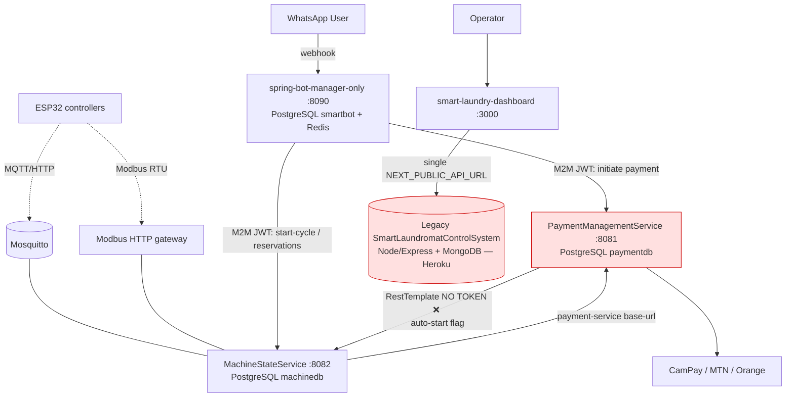

# Current Architecture — Smart Laundromat Ecosystem

**Status:** As-is analysis
**Date:** 2026-06-13
**Scope:** `spring-bot-manager-only`, `MachineStateService`, `PaymentManagementService`, `smart-laundry-dashboard` (+ the legacy `SmartLaundromatControlSystem` they implicitly depend on)
**Location analysed:** `C:\Users\sunda\Codierung`

---

## 1. System Purpose

A self-service laundromat platform for *Smart Laundry & Cafe Lounge – Douala (Cameroon)*. Customers interact through **WhatsApp**, pay via **mobile money (CamPay / MTN MoMo / Orange Money)** or **RFID cards**, and physical washers/dryers are driven by **ESP32 controllers** over **MQTT / Modbus RTU / EQLink**. Operators monitor everything through a **Next.js dashboard**.

---

## 2. Component Inventory

| # | Repository | Role | Runtime | Port | Datastore |
|---|------------|------|---------|------|-----------|
| 1 | **spring-bot-manager-only** | WhatsApp bot / conversation orchestration | Java 21, Spring Boot 3.3.7 (Maven multi-module) | 8090 | PostgreSQL `smartbot` (15432) + Redis |
| 2 | **PaymentManagementService** | Mobile money, RFID cards, top-ups, webhooks | Java 17, Spring Boot 3.3.5 | 8081 | PostgreSQL `paymentdb` (5434) |
| 3 | **MachineStateService** | Machine lifecycle, ESP32/MQTT/Modbus/EQLink, reservations | Java 17, Spring Boot 3.3.5 | 8082 | PostgreSQL `machinedb` (5435) |
| 4 | **smart-laundry-dashboard** | Operator web UI (revenue, machines, reports, HR) | Next.js 14 / React / TS / Tailwind | 3000 | — (HTTP client only) |
| — | *SmartLaundromatControlSystem* (legacy) | Original monolith the **dashboard actually calls** | Node.js / Express 5 / Mongoose | (Heroku) | **MongoDB** |

### 2.1 `spring-bot-manager-only` — modular monolith
Maven modules: `bot-core` (flow engine, WhatsApp client, Redis, persistence, MQTT manager), `bot-payment` (`PaymentGateway` → `DefaultPaymentGateway` HTTP delegate, webhook forwarder), `bot-laundry` (`LaundryBot`, `MachineService` HTTP delegate, reservations), `bot-pharmacy` (separate bot domain), `bot-app` (entry point, security, Auth0 M2M client).
- State in **Redis with in-memory fallback**; persistence via **PostgreSQL + Flyway** (the only service with real migrations).
- Authenticates **outbound** calls to the other two services with an **Auth0 M2M `client_credentials`** token (scopes such as `sls-machine-start`, `sls-payment-initiate`).

### 2.2 `PaymentManagementService`
- Providers (`CampayService`, `MtnMomoService`, `OrangeMoneyService`) via reactive `WebClient`.
- RFID card accounts (register / balance / debit / top-up), transactions, provider webhooks.
- `PaymentTimeoutService` marks pending payments `TIMEOUT` after 5 min.
- Optionally calls MachineStateService after a successful payment (`MachineStartService`, flag `eqlink.auto-start-machine-after-payment`, default **false**).
- OAuth2 **resource server** (Auth0). `ddl-auto: update`. **CamPay app key/secret/webhook-secret are hardcoded** in `application.yml`.

### 2.3 `MachineStateService`
- Machine state machine `IDLE → RUNNING → FINISHED → IDLE`, plus `ERROR / OFFLINE / MAINTENANCE`.
- Device integration: **MQTT (Paho/Mosquitto)** primary, **HTTP telemetry fallback**, **Modbus RTU** via serial↔HTTP gateway (feature-flagged), **EQLink Open API v2** (feature-flagged, MD5-signed).
- **Reservations** (1-hour slots, fee = highest cycle price) — and the bot calls back here to create/activate them.
- `CycleMonitorService` scheduled jobs: cycle-end detection, offline detection, auto-reset.
- OAuth2 **resource server** with **fine-grained scope→endpoint** authorization. `ddl-auto: update`.

### 2.4 `smart-laundry-dashboard`
- Next.js App Router, Recharts, **axios**, **socket.io-client**.
- **Single** backend base URL `NEXT_PUBLIC_API_URL` → points at the **legacy Node/Mongo monolith** (`/admin/*`, `/auth/login`, `/users`, `/timekeeping`, `/absences`, Mongo-style `_id` & `pages`, Heroku host).
- Auth is **localStorage bearer token** + custom `/auth/login` — **not Auth0**.
- Contains **two divergent API client files** (`src/services/api.ts` and `src/lib/api.ts`) describing overlapping but different endpoint sets.

---

## 3. Runtime Topology (as-is)

### Inter-service contracts
| Caller → Callee | Transport | Auth | Notes |
|-----------------|-----------|------|-------|
| Bot → Payment | `WebClient` (`microserviceWebClient`) | ✅ Auth0 M2M bearer | `.block()` synchronous |
| Bot → Machine | `WebClient` (`microserviceWebClient`) | ✅ Auth0 M2M bearer | `.block()`; exceptions swallowed on writes |
| Payment → Machine | `RestTemplate` | ❌ **no Authorization header** | Would be **401** against `SCOPE_sls-machine-start`; only “works” because flag defaults off |
| Machine → Payment | configured `payment-service.base-url` | partial | for reservation/RFID flows |
| Dashboard → Backend | `axios` | localStorage JWT | **points at legacy Mongo monolith, not the 3 services** |

---

## 4. Data & Persistence

- **Polyglot, fragmented:** 3 independent PostgreSQL databases (one per Spring service) + **1 MongoDB** (legacy, the dashboard’s real source of truth) + Redis (bot session/state).
- **No shared source of truth.** Transactions written to `paymentdb` and machine history written to `machinedb` are **not** the data the dashboard renders — that comes from the legacy Mongo system.
- **Schema management is inconsistent:** only the bot uses **Flyway**; Payment and Machine use Hibernate **`ddl-auto: update`** (schema drift, unsafe for production). Dev uses **H2 in-memory**, hiding Postgres-specific behaviour.

---

## 5. Security Posture

- **Good:** Auth0 OAuth2 resource servers with audience validation; MachineStateService has clean scope→endpoint mapping; stateless sessions; CORS configured; bot redacts `Authorization` in logs.
- **Bad:**
  - **Secrets committed to source** — CamPay app key/secret/webhook-secret (`PaymentManagementService/application.yml`), Auth0 `client-secret` and a live WhatsApp access token (`spring-bot-manager-only/application.yaml`). These are effectively leaked and must be rotated.
  - **Inconsistent service-to-service auth** (Payment→Machine unauthenticated; bot fallback WebClient sends no token).
  - **Dashboard auth** uses localStorage tokens (XSS-exposed) and a separate credential system from the rest of the platform (Auth0).

---

## 6. Identified Weak Points

| # | Weakness | Impact | Severity |
|---|----------|--------|----------|
| W1 | **Split-brain data** — dashboard reads legacy Mongo monolith, new services write to Postgres | Operators see stale/parallel data; the “3-service refactor” is not actually wired to the UI | 🔴 Critical |
| W2 | **No API gateway / BFF** — dashboard hardcodes one base URL; cannot aggregate 3 services | Can’t consume the new architecture; no central auth/routing/rate-limit | 🔴 Critical |
| W3 | **Secrets in source control** | Credential compromise (payment + WhatsApp + Auth0) | 🔴 Critical |
| W4 | **Inconsistent inter-service auth** (Payment→Machine no token; no-token fallback) | Broken/fragile calls; 401s when auto-start enabled | 🟠 High |
| W5 | **Circular dependency** Payment ↔ Machine, synchronous `.block()`, fire-and-forget with swallowed exceptions | Paid-but-never-started cycles, no retry/compensation, cascading failures | 🟠 High |
| W6 | **No resilience patterns** — no circuit breakers, retries, bulkheads; hardcoded `localhost` URLs; no service discovery | Outages cascade; not deployable as real microservices | 🟠 High |
| W7 | **Inconsistent schema management** (`ddl-auto: update` vs Flyway; H2 in dev) | Schema drift, prod surprises | 🟠 High |
| W8 | **Persistence sprawl** — 3 Postgres + 1 Mongo + Redis, no HA/clustering | High ops burden; no failover; migration friction | 🟡 Medium |
| W9 | **Dashboard auth mismatch + duplicated API clients** (`services/api.ts` vs `lib/api.ts`) | Divergence, XSS token exposure, maintenance cost | 🟡 Medium |
| W10 | **No event backbone / async messaging** for business events | Tight point-to-point coupling; no audit/event sourcing | 🟡 Medium |
| W11 | **Observability gaps** — no distributed tracing, correlation IDs, or centralized metrics across services | Hard to debug cross-service flows | 🟡 Medium |
| W12 | **MachineStateService overloaded** — device control (MQTT/Modbus/EQLink) + lifecycle + reservations in one service | Low cohesion; blast radius | 🟢 Low |

---

## 7. What Works Well (keep)

- Clean **modular boundaries** in the bot (`bot-core`/`bot-payment`/`bot-laundry`) with interface-based delegation — the refactor from in-process to HTTP was done behind stable interfaces.
- **Scope-based authorization** model in MachineStateService is a good template for all services.
- **Feature flags** (reservation, wash-flow, Modbus, EQLink, auto-start) allow safe rollout.
- **Device abstraction** — MQTT primary with HTTP/Modbus/EQLink fallbacks is pragmatic for heterogeneous hardware.
- Dashboard is a modern, typed Next.js app with a clear service layer (once pointed at the right backend).

---

## 8. Summary

The three Spring services are individually reasonable microservices, but the system as a whole is **mid-migration and not coherently wired**: the dashboard still depends on a legacy Node/Mongo monolith, the new services each own a separate Postgres database with no shared truth, inter-service auth and reliability are inconsistent, and secrets are committed. The next document proposes a target architecture that **consolidates persistence on a managed MongoDB cluster**, introduces an **API gateway + reporting BFF**, makes the **payment→machine** flow reliable and idempotent, and standardizes security and observability.
