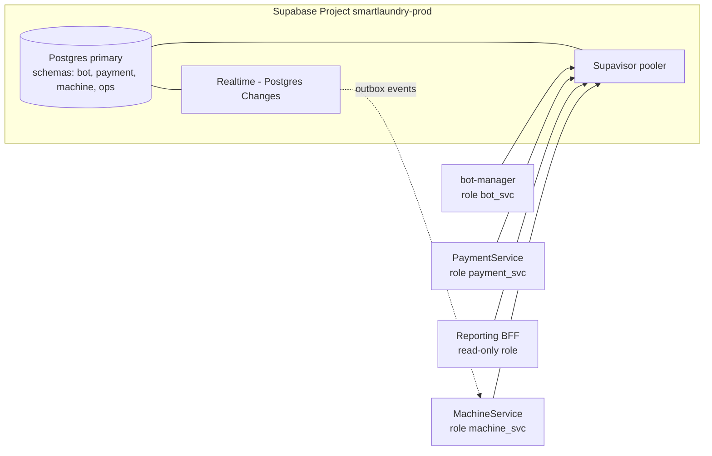

# ADR-001: Target Architecture for the Smart Laundromat Ecosystem

**Status:** Proposed
**Date:** 2026-06-13
**Deciders:** Platform owner (Gustave), backend lead, frontend lead, DevOps
**Supersedes:** Implicit dependency of `smart-laundry-dashboard` on the legacy `SmartLaundromatControlSystem` monolith
**Related:** [01-CURRENT-ARCHITECTURE.md](./01-CURRENT-ARCHITECTURE.md), [03-MIGRATION-TODO.md](./03-MIGRATION-TODO.md)

> **Revision (2026-06-13):** Decision A is revised. **A4 — managed PostgreSQL via Supabase, schema-per-service — is now CHOSEN**, replacing A2 (MongoDB Atlas). Rationale: once the legacy-data-affinity argument (temporary — retired in Phase 5) and the managed-ops argument (not Mongo-specific — Supabase provides the same for Postgres) are stripped out, A2 has little left in its favor, while A4 avoids the "team must learn Mongo modelling" cost entirely and keeps everything else in this ADR (gateway, outbox, event-driven pay→start, managed cluster) intact. A2 is retained below for the record as **superseded**.

---

## Context

The platform is mid-migration from a Node/Express + MongoDB monolith (`SmartLaundromatControlSystem`) to three Java/Spring microservices (`spring-bot-manager-only`, `PaymentManagementService`, `MachineStateService`) plus a Next.js dashboard. The current state (see analysis doc) has four structural problems:

1. **Split-brain data** — the dashboard still reads the legacy MongoDB monolith; the new services write to three separate PostgreSQL databases that the UI never sees.
2. **No front door** — no API gateway; the dashboard cannot consume the new services and there is no central place for auth, routing, CORS, or rate limiting.
3. **Unreliable critical path** — the *pay → start machine* flow is synchronous, fire-and-forget, partially unauthenticated, and has no retry/compensation, risking *paid-but-never-started* cycles.
4. **Operational fragility** — committed secrets, 3 Postgres + 1 Mongo + Redis with no HA, inconsistent schema management, and no cross-service observability.

**Constraints:** small team; single region (Cameroon / West Africa); existing operational data already lives in MongoDB; mobile-money flows demand financial correctness; ESP32 fleet must keep working through MQTT during any migration.

---

## Decision

Adopt a **gateway-fronted, event-aware microservice architecture backed by a single managed PostgreSQL (Supabase) project** using **schema-per-service isolation on a shared database** (see A4 below).

Concretely:

1. **Introduce an API Gateway** (Spring Cloud Gateway) as the single entry point for the dashboard and external webhooks — centralizing Auth0 JWT validation, routing, CORS, rate limiting, and correlation-ID injection.
2. **Add a Reporting / Analytics BFF** that aggregates payment + machine + bot data for the dashboard, replacing the dashboard’s dependency on the legacy monolith. Decommission the legacy Node/Mongo system once parity is reached (HR/timekeeping/feedback features either move into a dedicated `OperationsService` or are retired).
3. **Consolidate persistence onto a managed PostgreSQL project (Supabase)**: a single Postgres database, **schema-per-service** (`bot`, `payment`, `machine`, `ops`), each with a least-privilege Postgres role. Replaces the three independent PostgreSQL instances — same engine, one managed project.
4. **Make the pay→start flow reliable** with the **Transactional Outbox + idempotency** pattern over an event channel (Postgres `outbox` table + logical replication via Supabase Realtime / `pg_notify` initially; upgrade to Kafka/RabbitMQ if throughput grows). Break the Payment↔Machine cycle by replacing synchronous post-payment calls with events and a Saga with compensation.
5. **Standardize cross-cutting concerns**: every outbound service call carries an Auth0 M2M token; Resilience4j circuit breakers/retries/timeouts on all hops; all secrets in a secret manager; **Flyway** for schema migrations across all services; OpenTelemetry tracing end-to-end.
6. **Align the dashboard** to Auth0 (OIDC + PKCE), a single API client targeting the gateway, and gateway-brokered real-time updates.
7. **Make pricing dynamically configurable** (see Decision D): `application.yml` values become **seed defaults** for a `payment.pricing` table; PaymentManagementService exposes admin-protected pricing endpoints; the dashboard Settings UI reads/writes pricing through the gateway; the bot and MachineStateService read *effective* pricing from PaymentManagementService (cached, with their local yaml values as a resilience fallback).

---

## Target Topology

```mermaid
flowchart TD
    U[WhatsApp User] -->|webhook| GW
    OP[Operator] --> DASH[smart-laundry-dashboard\nAuth0 OIDC/PKCE]
    DASH -->|HTTPS + JWT| GW[API Gateway\nSpring Cloud Gateway\nauthN/Z · CORS · rate-limit · tracing]

    GW --> BOT[bot-manager :8090]
    GW --> PMS[PaymentService :8081]
    GW --> MSS[MachineService :8082]
    GW --> RPT[Reporting BFF / Analytics]
    GW --> OPS[OperationsService\n(users · timekeeping · feedback)]

    ESP[ESP32 fleet] -. MQTT .-> BRK[(MQTT broker)]
    BRK --- MSS
    ESP -. Modbus/HTTP .-> MSS

    BOT -->|M2M JWT| PMS
    BOT -->|M2M JWT| MSS
    DASH -->|edit pricing| GW
    GW -->|sls-pricing-manage| PMS
    BOT -. read effective pricing\ncached + yaml fallback .-> PMS
    MSS -. read effective pricing\ncached + yaml fallback .-> PMS
    PMS == publish PaymentSucceeded ==> BUS{{Event channel\nOutbox + Postgres Realtime / Kafka}}
    BUS == consume ==> MSS
    MSS == publish CycleCompleted ==> BUS
    BUS == consume ==> RPT
    PMS --> PROV[CamPay / MTN / Orange]

    subgraph SB[Supabase Postgres Project — managed, schema-per-service]
      direction LR
      SBB[(bot schema)]
      SBP[(payment schema)]
      SBM[(machine schema)]
      SBO[(ops schema)]
    end
    BOT --- SBB
    PMS --- SBP
    MSS --- SBM
    OPS --- SBO
    RPT -. read-only / replica .- SB
    REDIS[(Redis)] --- BOT

    classDef new fill:#e3f2e3,stroke:#2a7;
    class GW,RPT,OPS,BUS,SB new;
```

---

## Options Considered

### Decision A — Persistence platform

#### Option A1: Keep 3 PostgreSQL + legacy MongoDB (status quo)
| Dimension | Assessment |
|-----------|------------|
| Complexity | High (4 datastores, 2 engines) |
| Cost | Medium–High (4 instances) |
| Scalability | Manual; no HA configured |
| Team familiarity | Mixed |
| Migration effort | None |

**Pros:** No data migration; relational integrity in payment.
**Cons:** Split-brain persists; no HA; 2 engines to operate; dashboard still tied to Mongo.

#### Option A2 (SUPERSEDED by A4 — see revision note above): Single MongoDB Atlas cluster, database-per-service
| Dimension | Assessment |
|-----------|------------|
| Complexity | Medium (one managed platform) |
| Cost | Medium (one M10+ cluster, managed) |
| Scalability | Replica set → HA now; sharding later; analytics node for reporting |
| Team familiarity | High on the Node side (Mongoose); learnable via Spring Data MongoDB |
| Migration effort | Medium (Postgres→Mongo for 3 services; legacy data already in Mongo) |

**Pros:** One managed, HA datastore (automatic failover, continuous backup, point-in-time restore); the **legacy data is already MongoDB**, so the reporting consolidation and decommissioning are far easier; document model fits telemetry/events/transactions/reservations; **time-series collections** for ESP32 telemetry and **TTL indexes** for events/heartbeats/idempotency; multi-document **ACID transactions** on a replica set cover debit+transaction writes; per-service DB + user keeps logical isolation.
**Cons:** Loses native relational constraints (mitigated by schema validation + transactions); team must learn Spring Data MongoDB and Mongo modelling.

> **Why A2 was dropped:** Its two strongest selling points don't hold up once examined. (1) "Legacy data is already Mongo" only matters until Phase 5 retires the legacy monolith — it's a *temporary* migration-ordering convenience, not a lasting architectural property. (2) "Managed HA/backups/PITR" is a property of *Atlas*, not of MongoDB as a data model — Supabase gives the same for Postgres. Once those two are removed, what's left is "better fit for flexible documents" (true for telemetry/conversation-state, but solvable with JSONB columns) against "the team has to learn an entirely new data model and query language." A4 wins that trade.

#### Option A3: Single PostgreSQL cluster (schema-per-service)
**Pros:** Strong relational guarantees; one engine.
**Cons:** Doesn’t leverage existing Mongo data; legacy dashboard migration stays hard; weaker fit for flexible telemetry/event documents; you’d still rewrite the Mongo legacy data.

#### Option A4 (CHOSEN): Managed PostgreSQL via Supabase, schema-per-service
| Dimension | Assessment |
|-----------|------------|
| Complexity | Low–Medium (one engine, one managed provider, one project) |
| Cost | Low (Supabase free tier for dev; Pro ≈ $25/mo covers solo-dev/small-team production scale) |
| Scalability | Managed HA Postgres (Pro+) with PITR; built-in connection pooling (Supavisor); read replicas as a later scale trigger |
| Team familiarity | Highest — already on Spring Data JPA/Postgres/Flyway; zero new query language or ORM |
| Migration effort | Low — **consolidation, not rewrite**: 3 existing Postgres DBs → 3 schemas in 1 Supabase project; standardize on Flyway |

**Pros:** Keeps the existing JPA/Flyway investment entirely — this is the cheapest possible migration path (point datasources at the new project, run `pg_dump`/`pg_restore` into per-service schemas, no entity rewrites); **native multi-table ACID transactions** for money (no Mongo-style "multi-document transaction" workaround needed — this is what Postgres has always done); **JSONB columns** give the document-style flexibility A2 was chosen for (bot conversation state, variable telemetry payloads) while staying indexable (`jsonb_path_ops`) and joinable with relational columns; Supabase bundles managed backups + PITR + connection pooling + a Postgres-Changes/Realtime feed (the outbox-relay equivalent of Change Streams) — addressing the "managed ops" argument without a new engine; one provider, one bill, solo-dev-friendly.
**Cons:** ESP32 telemetry/time-series isn't as turnkey as Mongo's native time-series collections + TTL indexes — needs native **table partitioning** (RANGE by timestamp) + `pg_cron` for retention (TTL-equivalent); schema-per-service in one Postgres instance is isolated via roles/grants rather than fully separate database processes (acceptable at this scale; can split into separate Supabase projects later if a service's blast radius needs to be fully contained).

> **Why A4:** It keeps everything else in this ADR that is clearly right — gateway, outbox, event-driven pay→start, a managed cluster with backups/HA — while eliminating the costliest line item in A2 (learning a new data model) and the biggest correctness simplification (native multi-table transactions for mobile-money debits, vs. Mongo's more constrained multi-document transaction semantics). For a solo developer in Cameroon/West Africa on a cost-sensitive budget who already has 3 working Postgres databases and Spring Data JPA code, "consolidate the 3 databases you have" beats "rewrite 3 services onto a new data model" on every axis except the (temporary, already-scheduled-for-retirement) legacy-Mongo affinity.

---

### Decision B — Pay→Start reliability

| Option | Complexity | Reliability | Chosen |
|--------|------------|-------------|--------|
| B1: Keep synchronous `RestTemplate`, fix only auth | Low | Low — still loses starts on failure | ✗ |
| B2 (CHOSEN): **Outbox + events + idempotency + Saga** | Medium | High — at-least-once delivery, retries, compensation | ✓ |
| B3: Full Kafka event-sourcing now | High | High | ✗ (over-engineered for current scale) |

**B2 rationale:** Payment writes the transaction **and** an outbox record in one Postgres transaction (native ACID — simpler than Mongo's multi-document transaction semantics); a publisher relays `PaymentSucceeded` to the event channel (**Postgres logical replication via Supabase Realtime "Postgres Changes", or a `pg_notify` trigger, to start — minimal new infra). MachineService consumes idempotently (idempotency key = transaction reference, TTL-style cleanup via `pg_cron`) and starts the cycle; on permanent failure a compensation refunds/flags. This breaks the circular sync dependency and eliminates *paid-but-never-started*. Swappable to Kafka/RabbitMQ later behind the same publisher interface.

---

### Decision C — Front door & dashboard data source

| Option | Notes | Chosen |
|--------|-------|--------|
| C1: Dashboard calls 3 services directly (CORS to each) | No central auth/rate-limit; brittle | ✗ |
| C2 (CHOSEN): **API Gateway + Reporting BFF**; retire legacy | Single entry, central auth, aggregation; clean decommission path | ✓ |
| C3: Keep legacy monolith as the dashboard backend indefinitely | Permanent split-brain | ✗ |

---

### Decision D — Pricing configuration source of truth

**New requirement:** cycle prices (short/long/heavy cycles, per-program prices, reservation fee) must default from `application.yml` but be **overridable at runtime from the dashboard**, by operators with the right role.

| Option | Notes | Chosen |
|--------|-------|--------|
| D1: Keep prices in `application.yml` / JSON config only (status quo) | Requires a redeploy to change a price; dashboard "Program Pricing" form stays a non-functional stub | ✗ |
| D2 (CHOSEN): **`payment.pricing` table, seeded from `application.yml`**; PaymentManagementService owns reads/writes; dashboard edits via gateway | One source of truth for money-relevant prices; yaml becomes seed/fallback only; small surface area | ✓ |
| D3: New standalone "Config Service" + its own schema for all runtime-tunable settings | Generalizes beyond pricing, but is a new service for a need that's currently just pricing | ✗ (premature) |

**D2 design:**
- **Storage:** a `pricing` table in the `payment` schema (Phase 3/A4 — fits the consolidated Postgres project directly): `key` (e.g. `short_cycle`, `long_cycle`, `reservation_fee`, or a per-program key), `amount`, `currency`, `updated_at`, `updated_by`. A Flyway migration seeds rows from the current `PaymentConfig.Pricing` / `LaundryBotConfig` / `ReservationProperties` defaults in `application.yml` — **those yaml values remain as compile-time defaults / disaster-recovery fallback**, not the runtime source.
- **API:** PaymentManagementService exposes `GET /api/pricing` (scope `sls-pricing-read`) and `PUT /api/pricing/{key}` (scope `sls-pricing-manage`, restricted to ADMIN/OWNER — matches the dashboard's existing `editableRoles` on the Settings → Machines tab).
- **Consumers:** the bot (`LaundryBotConfig` cycle prices) and MachineStateService (`ReservationProperties.feeAmount`) currently hold their **own** copies of these numbers; they switch to reading *effective* pricing from PaymentManagementService via the M2M client, with a short-TTL cache (e.g. 60s, Caffeine) and **Resilience4j fallback to their local yaml defaults** if PaymentManagementService is unreachable — consistent with the resilience patterns already planned in Decision items 1/5.
- **Cache invalidation:** when an admin saves new pricing from the dashboard, PaymentManagementService writes the `pricing` table and emits a `PricingUpdated` event through the **same outbox/Postgres-Realtime mechanism** built for Decision B — bot and MachineStateService subscribe and refresh their cache immediately instead of waiting out the TTL. This reuses Phase 4 infrastructure rather than adding a new one.

> **Why D2:** It fits the A4 architecture directly — one more table in the already-consolidated `payment` schema, one more pair of scope-protected endpoints behind the gateway, and the cache-invalidation event reuses the outbox/Realtime channel already being built for pay→start. No new service, no new datastore, and the dashboard's existing (currently non-functional) "Program Pricing" form finally gets a backend.

---

## Supabase Postgres Cluster Design (deployed environment)

**Platform:** Supabase managed PostgreSQL — **Pro** tier for production (free tier for dev/test), region closest to West Africa (e.g. `eu-central-1`).

- **Topology:** one Supabase project `smartlaundry-prod` — managed Postgres primary with daily backups + **point-in-time recovery** (Pro plan), fronted by the **Supavisor** connection pooler (transaction-mode pool for the 3 Spring services + gateway + BFF).
- **Isolation:** **schema-per-service** in a single database — `bot`, `payment`, `machine`, `ops` — each with a dedicated least-privilege Postgres role (`payment_svc` granted only on `payment` schema, etc.), enforced via `GRANT`/`REVOKE` and (optionally) Row-Level Security.
- **Tables & patterns:**
  - `machine` schema: `machines`, `cycles`, `reservations`; `machine_events`/`telemetry` as **range-partitioned tables** (partition by day/month on timestamp) with a **`pg_cron`** job dropping old partitions (TTL-equivalent).
  - `payment` schema: `transactions`, `rfid_cards`, `topups`, `outbox`, `idempotency_keys` (with `expires_at` + `pg_cron` cleanup), `pricing` (Decision D — runtime-configurable cycle/program/reservation prices, seeded from `application.yml`). Debit + transaction insert use **native multi-table ACID transactions** — no special pattern required.
  - `bot` schema: `bot_configs`, `conversation_state` (JSONB column for flexible per-flow variables; Redis remains the hot session cache).
  - Each write-side service owns an **`outbox`** table consumed via **Supabase Realtime "Postgres Changes"** (logical replication) or a `pg_notify` trigger relay.
- **Consistency:** standard Postgres ACID guarantees; JSON-Schema-equivalent validation via `CHECK` constraints / `jsonb_schema` where columns are JSONB.
- **Connection:** `postgresql://...pooler.supabase.com:6543` (Supavisor, transaction mode) from each Spring Data JPA service with a small HikariCP pool; connection string + creds from secret manager only.
- **Resilience/Ops:** Supabase **daily backups + PITR** (Pro), dashboard metrics/alerts, SSL-enforced connections, IP allow-list / network restrictions.
- **Migrations:** **Flyway** changelogs per service (the bot service already does this — extend the same approach to Payment and Machine, replacing `ddl-auto: update`).
- **Scale path:** start on a single project; if a service's volume or isolation needs outgrow shared tenancy, split its schema into its **own Supabase project** (clean boundary since it's already schema-isolated), or add **read replicas** (Team plan) for the Reporting BFF.



---

## Trade-off Analysis

- **Three databases → one project, schema-per-service:** We give up fully separate database processes per service. Mitigated by Postgres roles/grants for isolation; revisit (split into separate Supabase projects) only if a service's blast radius genuinely needs harder isolation.
- **Relational stays relational — and that's the point:** No FK/joins are lost (unlike the A2 path). JSONB columns absorb the cases that motivated "document flexibility" (bot conversation state, variable telemetry payloads) while staying queryable and joinable.
- **Sync simplicity → eventual consistency (pay→start only):** The outbox/event path adds moving parts but is the only way to make pay→start reliable; Postgres logical replication (Supabase Realtime) keeps new infrastructure minimal.
- **More components (gateway, BFF) → more surface:** Justified — they are the prerequisite to actually using the new services and retiring the legacy monolith. Unaffected by the A2→A4 change.
- **Single managed project → single platform dependency:** Accepted in exchange for managed HA-ish backups/PITR, pooling, and one operational surface instead of three unmanaged Postgres instances — at materially lower cost than a Mongo Atlas cluster.

---

## Consequences

**Easier after:**
- Dashboard finally renders live data from the new services (no split-brain).
- Backups, PITR, and connection pooling come from managed Supabase instead of three unmanaged Postgres instances.
- Reliable, idempotent, compensatable payment→start path — and **simpler** than the Mongo path, since multi-table ACID transactions are Postgres's native behaviour.
- One auth model (Auth0) end-to-end; central rate-limiting and tracing.
- Legacy Node/Mongo monolith can be decommissioned.
- **No new data-modelling paradigm to learn** — existing JPA entities, repositories, and (for the bot service) Flyway migrations carry over with minimal change.

**Harder / to revisit:**
- Schema-per-service in one Postgres instance means noisy-neighbour risk (one service's heavy query load can affect others) until/unless split into separate projects.
- ESP32 telemetry retention needs manual partitioning + `pg_cron`, vs. Mongo's built-in TTL/time-series collections — more setup, but well-understood Postgres patterns.
- Event-driven flows still need idempotency discipline and DLQ/monitoring (unchanged from the A2 plan).
- Payment and Machine services must standardize on Flyway (currently `ddl-auto: update`) as part of the consolidation.

**Revisit triggers:** sustained telemetry/transaction volume or noisy-neighbour contention → split a schema into its own Supabase project, add partitioning/read replicas, or introduce Kafka; multi-region expansion → revisit provider/region strategy; if a specific service's document-shaped data genuinely outgrows JSONB → consider a targeted document store for *that* service only (not a platform-wide switch).

---

## High-Level Action Items
1. [ ] Stand up the API Gateway and route the dashboard through it.
2. [ ] Provision the Supabase Postgres project (schema-per-service) + per-service roles.
3. [ ] Consolidate each service's existing Postgres DB into the Supabase project (schema-per-service) and standardize on Flyway.
4. [ ] Build the Reporting BFF; reach dashboard parity; retire the legacy monolith.
5. [ ] Implement Outbox + Postgres Realtime (logical replication) + idempotency for pay→start; remove the circular sync call.
6. [ ] Standardize M2M auth, Resilience4j, secret management, OpenTelemetry.
7. [ ] Migrate the dashboard to Auth0 and a single gateway-targeted API client.
8. [ ] Add the `payment.pricing` table (seeded from `application.yml`), scope-protected pricing endpoints, bot/machine pricing client with cache + yaml fallback, and wire the dashboard's Settings → Machines "Program Pricing" form to it.

> Detailed, sequenced tasks are in **[03-MIGRATION-TODO.md](./03-MIGRATION-TODO.md)**.
