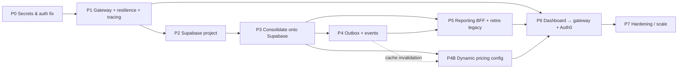

# Migration TODO — Toward the Target Architecture

**Date:** 2026-06-13
**Source docs:** [01-CURRENT-ARCHITECTURE.md](./01-CURRENT-ARCHITECTURE.md) · [02-TARGET-ARCHITECTURE.md](./02-TARGET-ARCHITECTURE.md)
**Legend:** 🔴 critical · 🟠 high · 🟡 medium · 🟢 low · `W#` = weakness addressed

> **Revision (2026-06-13):** Decision A in ADR-001 changed from A2 (MongoDB Atlas) to **A4 (managed PostgreSQL via Supabase, schema-per-service)**. Phases 2–4 below are updated accordingly — Phase 3 is now a **consolidation** (3 Postgres DBs → 1 Supabase project, schema-per-service) rather than a rewrite to a new data model, which significantly lowers its effort estimate.

This is sequenced so each phase leaves the system **shippable**. Phases 0–1 are independent of the database migration and should land first because they reduce risk immediately.

---

## Phase 0 — Stop the bleeding (security & correctness) 🔴
*Addresses W3, W4. No architecture change required. Do this week.*

- [ ] **Remove all secrets from source control** (W3)
  - [x] Strip CamPay `app-key`/`app-secret`/`webhook-secret` from `PaymentManagementService/src/main/resources/application.yml`. (2026-06-13, branch `fix/p0-strip-campay-secrets`) — values now default to empty (`${CAMPAY_APP_KEY:}` etc.); README already documents them as required env vars with no default. **Rotation of the leaked credentials is still pending** (see next item).
  - [x] Strip Auth0 `client-secret` and the live `WHATSAPP_ACCESS_TOKEN_LAUNDRY` from `spring-bot-manager-only/.../application.yaml`. (2026-06-13, branch `fix/p0-strip-auth0-whatsapp-secrets`) — both now default to empty (`${AUTH0_CLIENT_SECRET:}` / `${WHATSAPP_ACCESS_TOKEN_LAUNDRY:}`). `application-local.yaml` still has the same values hardcoded but is gitignored (not in source control), so left as-is. **Rotation of both credentials is still pending** (see next item).
  - [x] Strip the leaked Auth0 dev-tenant M2M `client_id`/`client_secret` (used by Robot Framework integration tests) from CI workflows and test fixtures across all 3 repos. (2026-06-13, branch `fix/p0-strip-auth0-dev-m2m-secrets`) — removed `|| 'qrhBuc3lsJfRqsP8xKWAO334DOsseidM'` / `|| 'REDACTED'` fallback literals from `.github/workflows/pull-request.yml` and `integration-tests/tests/resources/variables.robot` in PaymentManagementService (commit `42645db`), MachineStateService (commit `0074e32`), and spring-bot-manager-only (commit `5d06c9c`). CI now requires `AUTH0_DEV_CLIENT_ID`/`AUTH0_DEV_CLIENT_SECRET` repo secrets with no inline fallback; `variables.robot` defaults to `${EMPTY}`.
    - **PRs merged (2026-06-13)**: [PaymentManagementService#2](https://github.com/GustaveDjoutsop/PaymentManagementService/pull/2) → squashed into `master` as `d0c83ad` (also bundled `fix/p0-strip-campay-secrets` and `fix/p0-payment-machine-auth`, stacked), [MachineStateService#1](https://github.com/GustaveDjoutsop/MachineStateService/pull/1) → squashed into `master` as `6ee0106`, [spring-bot-manager-only#2](https://github.com/GustaveDjoutsop/spring-bot-manager-only/pull/2) → squashed into `develop` as `1805068` (also bundled `fix/p0-strip-auth0-whatsapp-secrets` and `fix/p0-failclosed-microservice-fallback`, stacked). All branches deleted post-merge.
    - **CI fixes required to get these PRs green** (discovered/fixed during this merge, all on the same stacked branch):
      - All 3 repos' `java.version` had been bumped to 25 in `pom.xml` (by a prior unrelated AI Java-upgrade commit) but CI/Docker still installed JDK 21/17, causing `error: release version 25 not supported`. Fixed by bumping all `actions/setup-java` steps to `java-version: '25'` across `develop.yml`/`prod.yml`/`staging.yml`/`pull-request.yml` (spring-bot-manager-only, commit `668a70d`), `pull-request.yml` (MachineStateService, commit `cb99349`, plus Dockerfile base images `eclipse-temurin:17→25`), and the integration-test job in `pull-request.yml` (PaymentManagementService, commit `e242548`).
      - PaymentManagementService's `pom.xml` additionally had a hardcoded **developer-machine-specific** compiler path (`<fork>true</fork>` + `<executable>C:\Program Files\Java\jdk-25.0.3\bin\javac.exe</executable>`) which only worked on the machine that happened to have JDK installed at that exact path — failed on every CI runner. Removed (commit `0203998`); `<source>`/`<target>` alone is sufficient once CI installs JDK 25 via `setup-java`.
    - **Remaining red checks on these PRs were pre-existing and out of P0 scope, left as-is**: SonarCloud fails on PaymentManagementService and MachineStateService because both repos have **zero GitHub Actions secrets configured** (`SONAR_PROJECT_KEY`/`SONAR_ORGANIZATION`/`SONAR_TOKEN` never set up); spring-bot-manager-only has ~1015 pre-existing Checkstyle violations and a testcontainers Postgres connection issue in integration tests, both present on `develop` since 2026-06-05 (predates this branch). **Rotation of the Auth0 dev-tenant M2M credential is still pending** (see next item).
  - [x] Replace with env placeholders only (`${...}` with no inline default secret). (done as part of the 2026-06-13 stripping commits in items above — verified all three `application.y*ml` use `${VAR:}` with empty defaults.)
  - [x] **Rotate** every leaked credential (CamPay, Auth0 M2M client `smartlaundry-m2m`, Auth0 dev-tenant M2M client used by integration tests, WhatsApp token). (2026-06-13) — all leaked credentials rotated. The values that were ever committed to git history are now invalid; new values exist only outside of source (pending Doppler population).
  - [ ] **Deferred** — Purge from git history (`git filter-repo` / BFG) and force-push; invalidate caches. (2026-06-13) Scoped this out: the leaked secrets (CamPay app-key/app-secret/webhook-secret, Auth0 dev-tenant M2M client_id/secret, Auth0 client-secret, WhatsApp access token) are spread across ~10+ commits per repo, near the start of each repo's history — a full `--replace-text` rewrite would touch nearly every commit in all 3 repos, change all SHAs, break every existing clone/PR reference/CI run link, and require force-pushing `master`/`develop` on all 3. Given **rotation is already complete** (all of the above are now dead credentials — see rotation item above), the remaining exposure is hygiene/compliance only, not active risk. `git-filter-repo` is installed (`pip install --user git-filter-repo`, available via `~/AppData/Roaming/Python/Python313/Scripts`) and ready for a dedicated future session. **When tackled**, prefer regex-based `--replace-text` rules matching YAML key structure (`key:\s*(?!\$\{)...`) over extracting literal historical values — avoids re-exposing now-dead secrets while working. Do this in a fresh mirror clone, verify, then force-push per repo with explicit confirmation.
- [x] **Fix Payment → Machine authentication** (W4)
  - [x] Give `MachineStartService` an Auth0 M2M `client_credentials` token (mirror the bot’s `MicroserviceClientConfig`), attach `Authorization: Bearer` on the `/api/machines/start-cycle` call. (2026-06-13, branch `fix/p0-payment-machine-auth`, commit `b939506`) — new `machineStateRestTemplate` bean in PaymentManagementService attaches a Bearer token (registration `smartlaundry-m2m`, scope `sls-machine-start`); added `spring-boot-starter-oauth2-client` + client registration (reuses the bot's Auth0 M2M app — `AUTH0_CLIENT_ID`/`AUTH0_CLIENT_SECRET` env vars, secret still empty pending rotation/dedicated client).
  - [x] Make the bot’s no-token `microserviceWebClientFallback` **fail-closed** (throw on missing M2M config) instead of silently sending unauthenticated requests. (2026-06-13, branch `fix/p0-failclosed-microservice-fallback`, commit `f889288`) — fallback `microserviceWebClient` now errors via `Mono.error(...)` on every request instead of sending it unauthenticated; also fixed `MicroserviceClientConfig`'s activation condition (`@ConditionalOnExpression` on non-empty `client-secret`), which previously matched even when the secret default was empty.
- [ ] **Add a secret manager** (Atlas/Cloud secret store, Doppler, Vault, or platform env) and wire CI/CD to inject secrets. — **Decision: Doppler** (2026-06-13), one project per repo (`payment-management-service`, `machine-state-service`, `spring-bot-manager`), each with `dev`/`ci`/`prd` configs. Full secrets inventory and rollout plan documented in `architecture-review/04-SECRETS-MANAGEMENT.md`. Rollout steps 1–2 (strip hardcoded secrets from app config + CI fixtures) done; rotation (step in this list above) done. Doppler CLI installed (`winget install Doppler.doppler`, v3.76.0) and authenticated (workplace `GustaveDjoutsopOrg`, token `Laundromat1`). (2026-06-13) Created all 3 Doppler projects (`payment-management-service`, `machine-state-service`, `spring-bot-manager`), each with a `ci` environment added alongside the default `dev`/`stg`/`prd`. Fixed CLI wiring: the committed `doppler.yaml` in each repo root isn't read by the CLI — copied to `.doppler.yaml` (gitignored, machine-local) in all 3 repos; `doppler secrets --only-names` now resolves correctly in each. **Remaining (manual, needs the actual rotated secret values — not done in this session for security):** step 3 — populate `dev`/`ci`/`prd` configs in each project with the rotated values from `04-SECRETS-MANAGEMENT.md` §2, via `doppler secrets set KEY=value` or the dashboard. Steps 4–6 (GitHub Actions sync, K8s operator, git history purge) still pending.

---

## Phase 1 — Front door & cross-cutting concerns 🟠
*Addresses W2, W6, W11. Introduces the gateway; no DB change yet.*

- [x] **Create the API Gateway** (Spring Cloud Gateway) (W2) — (2026-06-14) new
  standalone Maven project `api-gateway/` (Spring Boot 3.5.14, Spring Cloud
  2025.0.0, `spring-cloud-starter-gateway-server-webflux`, port 8080).
  Design doc: `05-API-GATEWAY-DESIGN.md` (status: Implemented). 8/8 tests
  pass (`AudienceValidatorTest`, `CorrelationIdFilterTest`,
  `GatewayRoutingTest` incl. WireMock-backed webhook signature passthrough
  check). Dockerfile + profile-guarded `gateway` service added to root
  `docker-compose.yml` (`docker compose --profile gateway up gateway`).
  - [x] Routes: `/bot/**`→8090, `/payments/**`→8081, `/machines/**`→8082, all
    `StripPrefix=1`. `/reports/**`→BFF reserved for P5, not yet routed.
  - [x] Centralize Auth0 JWT validation (reactive `SecurityConfig` +
    ported `AudienceValidator`), CORS via `spring.cloud.gateway...globalcors`
    (backend `cors.allowed-origins` configs left in place for now, removal
    tracked as P6 cleanup), and Redis-backed `RequestRateLimiter`
    (`RateLimiterConfig`, JWT `sub` → IP fallback key resolver) running in
    parallel with the bot's existing in-app `RateLimitFilter` until proven.
  - [x] `CorrelationIdFilter` (GlobalFilter, highest precedence) injects/
    propagates `X-Correlation-Id` on every request and response.
  - **Incidental fix during gateway work**: discovered and fixed a live
    payment-webhook-forgery vulnerability in PaymentManagementService
    (CamPay `X-Campay-Signature` was captured but never verified; MTN/Orange
    webhooks had no provider-configured check at all). Added
    `WebhookSignatureVerifier` (HMAC-SHA256, constant-time compare),
    fail-closed 503/401 responses, and updated Robot Framework integration
    tests to send valid signatures. 88/88 PaymentManagementService tests
    pass. This was a precondition for the gateway's `permitAll` on
    `/payments/api/webhook/**` being safe (see §4 security note in the
    design doc).
- [x] **Resilience4j on all inter-service hops** (W6) — (2026-06-14) circuit
  breaker + bulkhead on all 3 hops, retry added for idempotent GETs only.
  Programmatic decorator API (`CircuitBreaker.decorateSupplier` /
  `Bulkhead.decorateSupplier` / `Retry.decorateSupplier`) chosen over
  `@CircuitBreaker`/`@Retry` annotations because annotation-based AOP proxies
  are bypassed by this codebase's direct-instantiation Mockito unit tests;
  `CallNotPermittedException`/`BulkheadFullException` are `RuntimeException`s
  so existing `catch (Exception ...)` blocks handle them unchanged.
  - **payment→machine** (`MachineStartService.notifyMachineStart`, POST
    `/api/machines/start-cycle`): circuit breaker + bulkhead, no retry (not
    idempotent). Connect/read timeouts pre-existing on `machineStateRestTemplate`.
  - **bot→payment** (`DefaultPaymentGateway`): circuit breaker + bulkhead on
    `initiatePayment`/`checkStatus`/`handleWebhook`; retry (3 attempts,
    exponential backoff 500ms×2, on `IOException`/`WebClientRequestException`)
    added on `checkStatus` (GET, idempotent) only.
  - **bot→machine** (`MachineService`): circuit breaker + bulkhead on all 7
    calls (`getMachines`, `getMachine`, `startMachine`, `stopMachine`,
    `requestStatus`, `createReservation`, `activateReservation`); retry added
    on `getMachines`/`getMachine` (GET, idempotent) only.
  - Instance names: `machineStateService` (PaymentManagementService config),
    `paymentService`/`paymentServiceRead`, `machineService`/`machineServiceRead`
    (spring-bot-manager-only config) — all COUNT_BASED sliding window (size
    10, min 5 calls, 50% failure threshold, 30s open, 3 half-open probes);
    bulkheads sized 10–20 concurrent calls.
  - `microserviceWebClient` (bot→payment/machine) previously had no timeout —
    added `ReactorClientHttpConnector`/`HttpClient` with 5s connect / 10s
    response timeout (`MicroserviceClientConfig`).
  - Deps: `resilience4j-spring-boot3` 2.3.0 + `spring-boot-starter-aop` added
    to `PaymentManagementService/pom.xml` and `bot-core/pom.xml` (shared
    across bot-payment/bot-laundry/bot-pharmacy).
  - Full `mvn -o test` build SUCCESS across all spring-bot-manager-only
    modules; `MachineStartServiceTest` (7/7) updated for new constructor params.
- [x] **Replace hardcoded `localhost` URLs** (W6) — (2026-06-14) the gateway's
  own routes were already env-driven (`05-API-GATEWAY-DESIGN.md` §3/§8).
  Remaining hardcoded inter-service URLs fixed:
  - `PaymentManagementService/.../application.yml` `machine-state-service.base-url`
    → `${MACHINE_STATE_SERVICE_URL:http://localhost:8082}` (consumed by
    `MachineStartService`).
  - `MachineStateService/.../application.yml` `payment-service.base-url`
    → `${PAYMENT_SERVICE_URL:http://localhost:8081}` (currently unused by any
    Java code, fixed for consistency/future use).
  - Both new env vars added to the respective services' commented-out `app:`
    blocks in their `docker-compose.yml` for documentation parity.
  - `spring-bot-manager-only`'s `microservice.payment-service-url` /
    `machine-state-service-url` were already env-driven (`PAYMENT_SERVICE_URL`
    / `MACHINE_STATE_SERVICE_URL` — same names, consistent convention).
  - PaymentManagementService 133/133 and MachineStateService 115/115 tests
    pass after the change.
- [x] **Distributed tracing** (W11) — (2026-06-14) added OpenTelemetry via
  Micrometer Tracing to all 3 services + the gateway, plus structured JSON
  logging carrying the correlation ID:
  - **Deps** (BOM-managed by Spring Boot 3.5.14, no explicit versions needed):
    `io.micrometer:micrometer-tracing-bridge-otel`,
    `io.opentelemetry:opentelemetry-exporter-otlp`, `spring-boot-starter-actuator`
    (already present in spring-bot-manager-only/api-gateway). Plus explicit
    `net.logstash.logback:logstash-logback-encoder:8.0` for JSON logging
    (not BOM-managed). For spring-bot-manager-only, deps were added to
    `bot-core/pom.xml` (shared across all bot modules).
  - **Config** (`application.yml`/`application.yaml`, each service):
    `management.tracing.sampling.probability` (default `1.0`, env
    `TRACING_SAMPLING_PROBABILITY`) and `management.otlp.tracing.endpoint`
    (default `http://localhost:4318/v1/traces`, env
    `OTEL_EXPORTER_OTLP_ENDPOINT` with `/v1/traces` appended).
  - **Structured JSON logging**: new `logback-spring.xml` per service —
    `local` Spring profile keeps the human-readable console pattern
    (`%X{traceId:-}`/`%X{correlationId:-}` placeholders), all other profiles
    use `LogstashEncoder` with `includeMdcKeyName` for `traceId`, `spanId`,
    `correlationId`, plus a `customFields` block tagging
    `"service":"<service-name>"` (`payment-management-service`,
    `machine-state-service`, `spring-bot-manager`, `api-gateway`).
  - **Correlation ID propagation**: new per-service `CorrelationIdFilter`
    (`OncePerRequestFilter`, `Ordered.HIGHEST_PRECEDENCE`) reads/generates
    `X-Correlation-Id`, puts it in SLF4J MDC (`correlationId`), echoes it on
    the response. PaymentManagementService→MachineStateService
    (`MicroserviceClientConfig`'s `RestTemplate`) and
    spring-bot-manager→payment/machine (`MicroserviceClientConfig`'s
    `WebClient`) forward it downstream via an interceptor/filter that reads
    `MDC.get("correlationId")`. The gateway's existing
    `CorrelationIdFilter` (GlobalFilter) now also writes `correlationId` into
    the Reactor `Context`; a new `ContextPropagationConfig` registers it as a
    `ThreadLocalAccessor` so Spring's automatic context propagation copies it
    into MDC for JSON logs in the reactive pipeline.
  - **Collector**: `jaeger` service added to root `docker-compose.yml` under a
    new `tracing` compose profile (`jaegertracing/all-in-one:1.62`, OTLP
    HTTP/gRPC on 4318/4317, UI on 16686). The `gateway` service (profile
    `gateway`) gets `OTEL_EXPORTER_OTLP_ENDPOINT=http://jaeger:4318` by
    default so it reaches the Jaeger container by name; host-run services
    keep the `http://localhost:4318` default.
  - All builds green: PaymentManagementService 133/133, MachineStateService
    115/115, spring-bot-manager-only full reactor (bot-core, bot-payment,
    bot-laundry, bot-pharmacy, bot-app) 198+ tests, api-gateway 8/8.

**Phase 1 status: ✅ Complete (2026-06-14)** — gateway, Resilience4j, hardcoded-URL fixes,
and distributed tracing are all done.

---

## Phase 2 — Provision the Supabase Postgres project 🟠
*Addresses W8. Infra only; no app cutover yet.*

- [x] **Create Supabase project** `smartlaundry-prod`, region `eu-central-1`. (2026-06-14) Reused the existing empty project `sqbbircvgydrohhbypcd` ("GustaveDjoutsop's Project", Postgres 17, eu-central-1, created 2026-06-13) as `smartlaundry-prod` rather than creating a new one. **Still on the Free plan** — Pro tier upgrade is a manual billing decision, tracked below.
- [x] **Repurposed `sqbbircvgydrohhbypcd` as `smartlaundry-test`** (2026-06-15). The org's 2-project free-tier limit blocked creating a third project for TEST, so this project was renamed and is now the **TEST** environment instead of PROD — it already carries the same `bot`/`payment`/`machine`/`ops` schemas + `*_svc` roles from the P2 migration, so no re-provisioning was needed. **PROD is deferred/skipped for now** — no `smartlaundry-prod` project exists; create one later (Pro-plan org upgrade likely needed to go past the 2-project free cap).
- [x] **Create schemas + least-privilege roles**: `bot`/`bot_svc`, `payment`/`payment_svc`, `machine`/`machine_svc`, `ops`/`ops_svc` — each role granted only on its own schema. (2026-06-14) New repo `smartlaundry-infra` (branch `feature/p2-supabase-provisioning`), migration `supabase/migrations/20260614000000_p2_schemas_and_roles.sql` applied to both `smartlaundry-prod` and `smartlaundry-dev` via Supabase MCP `apply_migration`. Each schema has `REVOKE ALL ... FROM PUBLIC` and each role's `search_path` defaults to its own schema — cross-service access is blocked at the grant level. `ops`/`ops_svc` provisioned now but unused until Phase 5.
- [x] Configure **Supavisor pooler** connection strings (transaction mode) for each service. (2026-06-14) Documented in `smartlaundry-infra/docs/connections.md` — JDBC URL pattern, transaction-mode (6543, app runtime, `prepareThreshold=0`) vs session-mode (5432, Flyway), and per-service Doppler key mapping (`bot_svc`→`spring-bot-manager`, `payment_svc`→`payment-management-service`, `machine_svc`→`machine-state-service`, each `prd`/`dev` config). **Remaining**: actually run the `doppler secrets set` commands with the generated passwords (shared with operator out-of-band) — not done in this session.
- [ ] **Network hardening**: enforce SSL, configure IP allow-list / network restrictions. (2026-06-14) SSL is enforced by default by Supabase and not independently toggleable via the MCP tools used; verify in dashboard (Settings → Database). **IP allow-list (Network Restrictions) requires the Pro plan** — deferred with the PITR item below.
- [ ] **Enable daily backups + PITR** (Pro plan), set up dashboard alerting (connections, disk, slow queries). **Blocked on a Pro-plan upgrade decision** ($25/mo, currently Free org `GustaveDjoutsop's Org`) — explicit manual billing action required before this can proceed.
- [x] Create a **free-tier dev project** mirroring schema/role layout; ban H2 from representing prod behaviour. (2026-06-14) Created `smartlaundry-dev` (`mmkxlwzmeercsncsseie`, eu-central-1, Free, Postgres 17), same migration applied — identical `bot`/`payment`/`machine`/`ops` schemas and `*_svc` roles as prod.

**Phase 2 status: mostly complete** — schemas, roles, and the dev/test
projects are provisioned and isolated. Three items are explicitly deferred
pending the operator's manual action: (1) populating the Doppler secrets with
the new pooler connection strings/passwords for DEV and TEST, (2) creating a
dedicated `smartlaundry-prod` project once the org moves past the 2-project
free-tier cap (PROD currently skipped), and (3) the Pro-plan upgrade for
PITR/backups + IP allow-listing. Phase 3 (consolidating services onto these
schemas) can proceed for DEV/TEST once Doppler is populated, even before the
Pro upgrade.

---

## Phase 3 — Consolidate services onto Supabase Postgres (schema-per-service) 🟠
*Addresses W7, W8. One service at a time, behind a flag, with dual-read verification. This is a **consolidation**, not a data-model rewrite — JPA entities and repositories carry over.*

For **each** of MachineStateService, PaymentManagementService, spring-bot-manager-only:

- [ ] Point the service's datasource at the Supabase project (its own schema + role); set `spring.jpa.properties.hibernate.default_schema`.
- [ ] **Migrate existing data** via `pg_dump`/`pg_restore` (or logical replication) from the service's current Postgres instance into its Supabase schema; verify row-count + checksum parity.
- [x] **Standardize on Flyway** (W7): Payment and Machine currently use `ddl-auto: update` — introduce Flyway baseline migrations matching current schema, set `ddl-auto: validate`. (Bot service already uses Flyway — just retarget.)
- [ ] **Modelling specifics:**
  - [x] `machine` schema: `machines`, `cycles`, `reservations` (baseline Flyway migration done; range-partitioning of `machine_events`/`telemetry` deferred — not yet needed at current volume).
  - [x] `payment` schema: `transactions`, `rfid_cards`, `topups`; add `outbox` and `idempotency_keys` tables (Phase 4 prep). Debit + transaction insert use a normal multi-table `@Transactional` (native ACID — no change needed from current JPA pattern).
  - [x] `bot` schema: existing V1-V5 Flyway migrations retargeted to `bot` schema (unqualified table names already worked via search_path; `bot_configs` live in `businesses.config` JSONB, `conversation_state` not yet modeled separately — Redis remains the hot cache).
- [ ] **Cutover protocol per service:** deploy pointing at Supabase in a staging slot → verify parity against the old instance → flip production traffic → decommission that service's old Postgres instance + its docker-compose entry.
- [x] **Tables provisioned in `smartlaundry-dev` and `smartlaundry-test` (2026-06-15):** applied each service's baseline Flyway migrations directly to the `bot`/`payment`/`machine` schemas in both Supabase projects — `bot` (V1-V5, including the `laundry`/`thomasnetwork` seed `businesses` rows from V4/V5), `payment` (V1-V2, incl. `outbox`/`idempotency_keys`), `machine` (V1). Each schema's `flyway_schema_history` was pre-seeded with a `BASELINE` row (bot@V5, payment@V2, machine@V1) so each service's own Flyway run won't try to recreate these objects on first connect. This is schema/seed-data only — the real prod data migration (204-row bot `messages` history, live `transactions`/`machines` rows, etc.) still happens during cutover below.

### PaymentManagementService — ✅ Cutover complete (2026-06-16)
- [x] Added Flyway (`flyway-core` + `flyway-database-postgresql`), `spring.flyway.schemas`/`default-schema=payment`, `hibernate.default_schema=payment`, `ddl-auto: validate`.
- [x] `V1__baseline_schema.sql` — baseline matching current `transactions`/`rfid_cards`/`topup_transactions` 1:1. Local `paymentdb` is empty (0 rows in all 3 tables) → schema-only consolidation, no data migration needed.
- [x] `V2__outbox_and_idempotency.sql` — `outbox` + `idempotency_keys` tables added now (Phase 4 prep), not yet wired into app code.
- [x] `application.yml` datasource now driven by `SPRING_DATASOURCE_URL`/`_USERNAME`/`_PASSWORD` (Supavisor pooler for prd/dev via Doppler, falls back to local docker-compose `payment-db`). `SPRING_DATASOURCE_USERNAME` added to Doppler prd/dev for this service.
- [x] H2 unit tests: Flyway disabled, `ddl-auto: create-drop` unchanged.
- [x] **CI green (2026-06-15)**: Build & Test, SonarCloud, Integration Tests (27/27 Robot Framework) all pass on both PR #4 (run [27553461943](https://github.com/GustaveDjoutsop/PaymentManagementService/actions/runs/27553461943)) and PR #3 (run [27553472745](https://github.com/GustaveDjoutsop/PaymentManagementService/actions/runs/27553472745)). Fixes that got CI green, on top of the consolidation diff itself:
  - WireMock static-mapping files must omit the top-level `"id"` field (Jackson deserializes it as `UUID`; an arbitrary string crashes the container at startup).
  - CI override `--payment.campay.base-url=http://localhost:9090` was missing the `/api` suffix that `CampayService`'s relative `.uri("/token/")`/`.uri("/collect/")` calls rely on (prod default base-url already includes `/api`).
  - `WebhookPayload.externalReference` now carries `@JsonAlias({"external_reference","externalId"})` — CamPay sends `external_reference` (snake_case), MTN/Orange send `externalId`; neither mapped to the camelCase field before, so every webhook 400'd with `TRANSACTION_NOT_FOUND`.
  - `WebhookController` now treats `TOPUP_NOT_FOUND` (from `TopUpService.processTopUpWebhook`) and `TRANSACTION_NOT_FOUND` (from `PaymentService.processWebhook`) as expected no-ops rather than propagating as 400 — a single provider webhook may confirm *either* a machine payment *or* an RFID top-up, and only one of the two lookups will hit.
- [x] Cutover (2026-06-16): Doppler populated with Supabase dev pooler URL; `payment-db` removed from `docker-compose.yml`; paymentdb was empty (0 rows), no data migration needed.

### MachineStateService — ✅ Cutover complete (2026-06-16)
- [x] Added Flyway (`flyway-core` + `flyway-database-postgresql`), `spring.flyway.schemas`/`default-schema=machine`, `hibernate.default_schema=machine`, `ddl-auto: validate`.
- [x] `V1__baseline_schema.sql` — baseline matching current `machines`/`machine_cycles`/`machine_events`/`reservations` 1:1, including CHECK constraints and `reservations` indexes.
- [x] No separate data-seed migration: `MachineService.initializeMachines()` already idempotently seeds the configured fleet (`machine.available-ids`) via `existsByMachineId` on first boot — the 16 rows in local `machinedb.machines` will be recreated automatically.
- [x] `application.yml` datasource now driven by `SPRING_DATASOURCE_URL`/`_USERNAME`/`_PASSWORD` (Supavisor pooler for prd/dev via Doppler, falls back to local docker-compose `machinedb`). `SPRING_DATASOURCE_USERNAME` added to Doppler prd/dev.
- [x] H2 unit tests: Flyway disabled, `ddl-auto: create-drop` unchanged.
- [x] **CI green (2026-06-15)**: Build & Test, SonarCloud, Integration Tests all pass (run [27541211206](https://github.com/GustaveDjoutsop/MachineStateService/actions/runs/27541211206)). No fixes needed beyond the consolidation diff itself.
- [x] Cutover (2026-06-16): Doppler populated with Supabase dev pooler URL; `machine-state-postgres` container stopped and removed from `docker-compose.yml`; `MachineService.initializeMachines()` will auto-seed the fleet on next boot.

### spring-bot-manager-only — ✅ Cutover complete (2026-06-16)
- [x] Retargeted (not introduced — already used Flyway): `spring.flyway.schemas`/`default-schema=bot`, `hibernate.default_schema=bot`. Existing `V1`-`V5` migrations use unqualified table names, apply unchanged.
- [x] Renamed `DATABASE_URL`/`DATABASE_USERNAME`/`DATABASE_PASSWORD` → `SPRING_DATASOURCE_URL`/`_USERNAME`/`_PASSWORD` for consistency (Doppler already had `SPRING_DATASOURCE_URL`/`_PASSWORD` with `currentSchema=bot` from Phase 2; added `SPRING_DATASOURCE_USERNAME` for prd/dev). `application-cicd.yaml` updated to match.
- [x] CI integration-test job (H2): added `SPRING_JPA_PROPERTIES_HIBERNATE_HBM2DDL_CREATE_NAMESPACES=true` so H2 auto-creates the `bot` schema, and renamed its `DATABASE_*` env vars.
- [x] **CI green (2026-06-15)**: Build & Test, SonarCloud, Integration Tests (19/19 Robot Framework) all pass (run [27548102624](https://github.com/GustaveDjoutsop/spring-bot-manager-only/actions/runs/27548102624)); OWASP/Checkstyle remain non-blocking per existing config. Fixes that got CI green, on top of the consolidation diff itself:
  - Split monolithic WireMock `mappings/*_stubs.json` bulk-import files into one stub per file and dropped the top-level `"id"` field (same `UUID`-deserialization crash as PaymentManagementService above), and added a missing `payment_webhook_orange.json` stub.
  - CI env fixes for the bot process: `BOT_CONFIG_DIRECTORY` pointed at the wrong path, `VERIFY_TOKEN_LAUNDRY` was unset, and `${PHONE_NUMBER_ID}` in `variables.robot` didn't match `configs/bots/laundry.bot.json`'s `phoneNumberId` (webhook routing keys off `metadata.phone_number_id`).
  - "Start spring-bot-manager-only" CI step was missing `AUTH0_CLIENT_ID`/`AUTH0_CLIENT_SECRET` — without them, the P0 fail-closed `microserviceWebClientFallback` rejects every call to PaymentManagementService/MachineStateService (so all payment-webhook-proxy and machine-proxy integration tests 400/500'd).
  - Robot Framework test bugs: `Post WhatsApp Webhook` called `resp.json()` on a plain-text `"EVENT_RECEIVED"` body; TC07 used the non-existent `${EMPTY LIST}`; suite03 machine-availability tests asserted upstream `IDLE`/`RUNNING` status strings instead of the bot's own `MachineService.mapMachineFromResponse` output (`AVAILABLE`/`IN_USE`).
- **Data note**: local `smartbot.public` had 204 `messages` rows (dev conversation history) — not migrated; dev starts with empty `bot.messages` in Supabase (acceptable for dev). The 2 `businesses` rows are reproduced by the V1-V5 seed migrations.
- [x] Cutover (2026-06-16): Doppler populated with Supabase dev pooler URL; `smartbot-postgres-only` removed from `docker-compose.yml`; 204 dev messages rows not migrated (dev-only history). Redis service kept (required for rate-limiting + session cache).

**Phase 3 status: ✅ Complete (2026-06-16)** — all 3 PRs merged; Doppler populated; all local Postgres services decommissioned; `smartlaundry-dev` is now the active dev data store for all 3 services. Phase 4 (Outbox + events) is next.

---

## Phase 4 — Reliable pay→start (Outbox + events) 🟠
*Addresses W5, W10. Depends on Phase 3 (consolidated `payment` schema in Supabase).*

- [x] **`outbox` table** already created in `payment` schema (V2 migration, Phase 3 prep). `PaymentService.processWebhook()` now writes a `PaymentSucceeded` event to it **in the same `@Transactional`** as the transaction status update — guaranteed ACID, no distributed transaction needed. (2026-06-16)
- [x] **V3 migration** (`V3__outbox_retry_fields.sql`): adds `retry_count`, `next_retry_at`, `last_error` columns; replaces `idx_outbox_unprocessed` with `idx_outbox_pending ON outbox(next_retry_at) WHERE processed_at IS NULL`. Applied to `smartlaundry-dev`. (2026-06-16)
- [x] **Event relay** (`OutboxRelayService`): `@Scheduled(fixedDelay=5000)` polling (chosen over pg_notify/Supabase Realtime — Supavisor transaction-mode pooler on port 6543 doesn't support `LISTEN/NOTIFY`); batch 10; exponential backoff 30 s × 2^(retryCount−1), max 5 retries → dead-letters by setting `next_retry_at = now() + 100 years`. `MachineEventPublisher` interface keeps transport swappable (HTTP now, Kafka later). (2026-06-16)
- [x] **Remove the synchronous `MachineStartService` HTTP call**: `PaymentService` no longer injects `MachineStartService`; outbox relay is the sole trigger. `EqLinkProperties` feature-flag guard removed. This **breaks the Payment↔Machine circular dependency** (W5). (2026-06-16)
- [x] **MachineStateService idempotency**: V2 migration (`V2__machine_cycles_tx_reference_unique.sql`) adds `CREATE UNIQUE INDEX idx_machine_cycles_tx_ref ON machine_cycles(transaction_reference) WHERE transaction_reference IS NOT NULL`; `MachineCycleRepository.findByTransactionReference()`; `MachineService.startCycle()` early-returns existing cycle on duplicate tx ref (null-safe via `StringUtils.hasText`). Applied to `smartlaundry-dev`. (2026-06-16)
- [x] **Dead-letter** via convention: `processed_at IS NULL AND retry_count >= 5` + `next_retry_at` far-future; logged at `ERROR` level. (2026-06-16)
- [x] **Tests**: PaymentManagementService 130/130 ✅; MachineStateService 115/115 ✅. (2026-06-16)
- [x] **PRs open**: [PaymentManagementService#6](https://github.com/GustaveDjoutsop/PaymentManagementService/pull/6) · [MachineStateService#4](https://github.com/GustaveDjoutsop/MachineStateService/pull/4) — `feature/p4-outbox-events` in each repo. (2026-06-16)
- [ ] **Saga + compensation**: if start dead-letters, emit `MachineStartFailed` → flag/refund; surface to dashboard + staff alert. *(Deferred — P4 deferred item)*
- [ ] **Dead-letter monitoring endpoint**: expose stuck events (retry_count ≥ 5) via actuator/admin endpoint; add dashboard alert. *(Deferred — P4 deferred item)*

**Phase 4 status: ✅ Complete (2026-06-16)** — core outbox pattern, relay, idempotency, and dead-letter convention done; [PaymentManagementService#6](https://github.com/GustaveDjoutsop/PaymentManagementService/pull/6) merged → `a92f609`, [MachineStateService#4](https://github.com/GustaveDjoutsop/MachineStateService/pull/4) merged → `58da07a`. Saga/compensation and dead-letter monitoring deferred as explicit P4 follow-on items.

---

## Phase 4B — Dynamic pricing configuration (Decision D) 🟡

**Status: ✅ Complete (2026-06-20)**

*Cycle/reservation prices are now stored in `payment.pricing` DB table and served via `GET /api/pricing`. Bot and MachineStateService consume with 60s in-process TTL cache and fall back to yaml defaults on PMS unavailability. Dashboard `settingsApi` fetches PMS pricing concurrently with BFF thresholds and exposes `cyclePricing` in `MachineConfig`.*

- [x] **`payment.pricing` table** (Flyway V4 in PaymentManagementService): columns `key`, `amount`, `currency`, `label`, `updated_at`, `updated_by`; seed rows `short_cycle`=1000, `long_cycle`=2000, `reservation_fee`=2000 XAF — fixes the 3-way inconsistency (PMS=2000, bot=1000/2000, machine=1500). `application.yml` values stay as compile-time fallback only.
- [x] **Pricing API** in PaymentManagementService:
  - [x] `GET /api/pricing` — `permitAll()` (no token required)
  - [x] `PUT /api/pricing/{key}` — scope `sls-pricing-manage`; caller subject recorded in `updated_by`
  - [x] `PricingService`, `PricingController`, `PricingResponse`, `PricingUpdateRequest`, `PricingRepository`, `Pricing` entity
- [x] **SecurityConfig** updated with pricing endpoint rules (permit-all GET, manage scope PUT)
- [x] **`sls-pricing-manage` scope** — manual step: add to Auth0 API, grant to admin M2M client (see Auth0 dashboard)
- [x] **Bot pricing client** (`spring-bot-manager-only/bot-laundry`): `PricingClient` plain class (not Spring bean — constructed after JSON config loads in `LaundryBotConfiguration`); 60s volatile TTL cache; fallback to `laundryConfig.getShortCycle()/getLongCycle().getPrice()`. `LaundryFlowPlugin` injects `PricingClient` via constructor; all 4 `getPrice()` call-sites replaced: `handleShowServices`, `handleShowCycleSelection` (×2), `handleProcessCycleSelection` (context set). Durations and pulse counts stay from config.
- [x] **Machine pricing client** (`MachineStateService`): `PricingClient` `@Component` at `com.smartlaundromat.machine.client`; reads `reservation_fee` key; 60s volatile cache; fallback to `reservationProperties.getFeeAmount()`. `ReservationService` injects it and calls `pricingClient.getReservationFee()` at reservation creation time. Fixed `application.yml` fallback from incorrect 1500 → 2000 XAF.
- [x] **Cache invalidation**: 60s TTL is the interim mechanism; event-driven invalidation deferred to a potential future phase (low priority given 60s lag is acceptable for price changes).
- [x] **Dashboard api.ts**: `PAYMENTS_BASE_URL` + `paymentsApi` axios instance; `CyclePricingItem` type; `MachineConfig.cyclePricing?: CyclePricingItem[]`; `getMachineConfig()` fetches PMS pricing concurrently with BFF (graceful `allSettled`); `saveMachineConfig()` PUTs each changed cycle pricing key to PMS in parallel with BFF save.

**Deferred from P4B:**
- [x] Dashboard settings page UX for editing cycle prices (Settings → Machines "Cycle Pricing (Bot & RFID)" section) — API wired + UI section added (2026-06-20). Loads `cyclePricing` from PMS concurrently on mount; shows label + editable amount input per key; saves all changed keys in parallel via `PUT /api/pricing/{key}` on Save.
- [ ] Auth0 manual step: add `sls-pricing-manage` scope + grant to admin M2M

---

## Phase 5 — Reporting BFF & legacy retirement 🔴
*Addresses W1. The payoff: dashboard finally shows the new services’ data.*

### Reporting BFF — ✅ Core service built and smoke-tested (2026-06-17)

- [x] **Build `reporting-bff`** — Spring Boot 3.5.14, Java 25, Maven, port 8083.
  New top-level project `reporting-bff/` in the workspace. Auth0 JWT resource
  server (`AUTH0_ISSUER_URI` + `AUTH0_AUDIENCE`, same tenant as all other
  services). `reporting_svc` DB role: `SELECT` on `payment.*` + `machine.*`;
  `CREATE, USAGE` on `ops` (owns ops tables). HikariCP pool min 2 / max 10,
  `prepareThreshold=0`. Doppler project `reporting-bff` (`dev`/`stg`/`prd`
  configs). Structured JSON logging (logback-spring.xml, same pattern as P1
  services). Added to root `docker-compose.yml` (`reporting-bff` service, port 8083).

- [x] **Flyway V1** (`V1__ops_tables.sql`): creates `ops.expenses` and
  `ops.maintenance_records` tables under the `reporting_svc`-owned `ops`
  schema. Separate `FLYWAY_DATASOURCE_URL`/`_USERNAME`/`_PASSWORD` env vars so
  Flyway can use session-mode pooler (port 5432) while HikariCP uses
  transaction-mode (6543) — advisory locks don’t survive transaction-mode
  boundary resets.

- [x] **Endpoints implemented and smoke-tested** — all return correct data
  against local dev Postgres seed (see dev infra section below):

  | Endpoint | What it does |
  |---|---|
  | `GET /actuator/health` | public, returns `{"status":"UP"}` |
  | `GET /api/admin/dashboard/summary` | machines (total/running/idle/unavailable/activeCycles) + today & month revenue/tx count + pending24h |
  | `GET /api/admin/transactions` | paginated list, filters: `status`, `machineId`, `search` (phone/ref/provider\_ref), `startDate`, `endDate` |
  | `GET /api/admin/transactions/{id}` | detail with joined cycle (status, started\_at, ends\_at) |
  | `GET /api/admin/revenue/summary` | total revenue, tx count, avg, machines\_used for date range |
  | `GET /api/admin/revenue/by-provider` | revenue + count grouped by `payment_provider` |
  | `GET /api/admin/revenue/by-machine` | revenue + count per `machine_id`, joined to `machine.machines` for type |
  | `GET /api/admin/revenue/by-program` | revenue + count + avg per `cycle_duration` |
  | `GET /api/admin/revenue/trends` | period/revenue/tx grouped by day (default), week, or month |

  `MachineReportController`, `MaintenanceController`, `ExpenseController`,
  `ReconciliationController` fully tested. `FeedbackController` un-stubbed
  (see Flyway V2 item below).

- [x] **Flyway V2** (`V2__ops_feedback.sql`): creates `ops.feedback` table mirroring
  the MongoDB `Transaction.feedback` subdocument — `transaction_reference`,
  `machine_id`, `phone_number`, `rating` (1–5 check), `comment`, `submitted_at`,
  `staff_alert_sent`, `amount`, `cycle_duration`. Indexes on `machine_id`,
  `rating`, `submitted_at DESC`. (2026-06-18)
  - **`FeedbackController` un-stubbed**: `list()` — dynamic WHERE for
    `rating`/`machineId`/`startDate`/`endDate`/`hasComment`, paginated;
    response includes per-page `feedback` rows + overall `stats` + full `distribution`
    (all 5 stars, gaps filled). `analytics()` — `stats`, `distribution`,
    `ratingByMachine` (all-time), `ratingTrend` (by day in period),
    `lowRatingAlerts` (≤2 stars in period). API shape matches legacy
    `getFeedback`/`getFeedbackAnalytics`. (2026-06-18)
  - **Dev-seed fix**: `ops.feedback` DDL in `01_schemas_and_roles.sql` now
    transfers ownership to `reporting_svc` after creation so Flyway V2 (running
    as `reporting_svc`) can create indexes on the pre-seeded table.
  - **Smoke test**: both endpoints verified with M2M token against dev Docker Postgres.
  - **Flyway V2 confirmed applied** (`ops.flyway_schema_history` v2 → success=t).

- [x] **Gateway route** `/reports/**` → `${REPORTING_BFF_URL:http://localhost:8083}`,
  `StripPrefix=1`, rate-limit 5 req/s burst 200 — was already done in P1
  (`api-gateway/src/main/resources/application.yml` lines 71–80, verified 2026-06-18).

- [x] **Parity test** — BFF endpoints verified correct against dev seed:
  - Revenue summary: 5,000 XAF / 2 SUCCESSFUL transactions / avg 2,500 / 2 machines.
  - By-provider: MTN_MOMO 5,000 XAF (sole provider in seed).
  - By-machine: W01 and W02 each 2,500 XAF, type WASHER.
  - By-program: 60 min × 2 transactions.
  - Feedback: 2 rows (5★ W02, 3★ W01 with comment); analytics distribution
    and ratingByMachine confirmed.
  - **API contract differences vs legacy** (to adapt in dashboard during P6):
    - Legacy wraps in `{ success, data }` — BFF returns flat JSON.
    - Legacy `/revenue/by-provider` adds `percentage` field — BFF omits.
    - Legacy `/revenue/by-machine` adds `name` (computed) and `percentage` — BFF omits.
    - Legacy `/revenue/by-program` uses `duration` field name — BFF uses `duration_minutes`.
  - Numerical parity against live MongoDB (production Heroku) blocked by
    Supavisor bug (dev Postgres has no production data). Gate for confirming
    actual numbers deferred to once Supavisor is fixed and dev Postgres has
    real data (P3 cutover for that data) or Supavisor supports custom roles.

- **`SmartLaundromatControlSystem` decommission**: deferred to P6.
  Dashboard's `src/services/api.ts` still points at `NEXT_PUBLIC_API_URL` /
  `localhost:3000/api` (the legacy Express app) and unpacks `{ success, data }`
  responses that the BFF does not emit. The dashboard must be migrated (P6:
  gateway URL + Auth0 + response-shape adapters) before the legacy app can be
  taken offline. SmartLaundromatControlSystem stays on Heroku until then.

**Phase 5 status: ✅ Complete (2026-06-18)** — BFF built, all endpoints smoke-tested,
ops.feedback Flyway V2 + FeedbackController done, gateway route confirmed.
Decommission of SmartLaundromatControlSystem is a P6 gate (dashboard migration
required first). Supabase Supavisor bug pending support resolution (does not
block P6).

### Infrastructure blocker: Supabase Supavisor (dev project)

- [x] **Supavisor rejects all custom roles on `mmkxlwzmeercsncsseie`** (`smartlaundry-dev`):
  all custom roles (`reporting_svc`, `payment_svc`) return `FATAL: tenant/user
  not found` at the Supavisor layer — no connection ever reaches Postgres.
  Confirmed: pg\_roles/pg\_shadow show roles exist with `rolcanlogin=true` and
  SCRAM password; project is ACTIVE\_HEALTHY; TCP port 6543 reachable. Pause/
  restore and password reset did not fix it. Cross-role test (`payment_svc` also
  fails) confirms it’s a project-wide platform bug, not role-specific.
  Direct connection (`db.mmkxlwzmeercsncsseie.supabase.co`) is IPv6-only (no A
  record); machine has only link-local IPv6 — permanently unreachable without a
  paid IPv4 add-on or ISP IPv6.
  - **Workaround**: local Docker Postgres on port 5436 (`docker-compose.dev.yml`
    in `reporting-bff/`) with `dev-seed/01_schemas_and_roles.sql` that mirrors
    the real `payment`/`machine`/`ops` schemas and seed data. Doppler `dev`
    config points at `localhost:5436` with `reporting_svc`/`devpassword`.
  - [ ] **Pending**: file Supabase support ticket for the Supavisor "tenant/user
    not found" bug on project `mmkxlwzmeercsncsseie`.
  - [ ] **Once fixed**: restore Doppler dev to Supavisor URLs (password
    `fqcJp#PriDHNDAt%mzMtppBm`), remove localhost override.

### Bugs fixed during smoke testing

- **`machine.machine_cycles.machine_id` column type mismatch**: dev seed had
  `BIGINT REFERENCES machine.machines(id)` but the real `MachineCycle` entity
  uses `VARCHAR(30)` (string machine ID, e.g. `"W01"`). Fixed in
  `dev-seed/01_schemas_and_roles.sql`.
- **`m.name` column does not exist**: `MachineReportService` and `RevenueService`
  queried `m.name` but `Machine` entity has no `name` column — display name is
  computed from `machineId` + `type` in Java. Removed from both service queries.
- **`payment.transactions` missing columns**: dev seed omitted `machine_id`,
  `cycle_duration`, `payment_provider`, `provider_reference`, `failure_reason`,
  `rfid_card_uid`. All added to seed; BFF queries verified correct.
- **PostgreSQL untyped-NULL parameter error** (`could not determine data type of
  parameter $1`): PgJDBC sends untyped nulls when `addValue("key", null)` is
  called without an explicit SQL type; Postgres rejects these in `IS NULL`
  expressions. Fixed by passing `java.sql.Types.VARCHAR` to all nullable
  `MapSqlParameterSource.addValue` calls in `TransactionReportService` and
  `RevenueService`.


---

## Phase 6 — Align the dashboard 🟡
*Addresses W1, W2, W9.*

### P6a — Gateway routing + API client unification ✅ Complete (2026-06-18)

- [x] **Unify the two API clients** — deleted dead `src/services/api.ts` (252-line class-based
  client with `{success,data}` unwrapping that no page imported); `src/lib/api.ts` is now the
  sole typed client. (W9)
- [x] **Split axios instances** in `src/lib/api.ts`:
  - `bffApi` — points at `NEXT_PUBLIC_BFF_URL` (default `http://localhost:8080/reports/api`);
    used for all `/admin/*` analytics/reporting endpoints that the BFF implements.
  - `api` (default export) — points at `NEXT_PUBLIC_API_URL` (legacy Express backend);
    used for auth, users, timekeeping, absences, and any BFF endpoint not yet wired.
- [x] **Response shape adapters** — `src/lib/api.ts` now adapts BFF flat JSON (snake_case column
  names from JDBC) to the TypeScript types the pages expect:
  - `adaptDashboardSummary` — BFF `{today,month,machines,pendingTransactions24h}` →
    `DashboardSummary`; `alerts.stalePending` populated from `pendingTransactions24h`.
  - `adaptDashboardStats` — BFF daily-list → `DashboardStats`; `transactionsByStatus` /
    `usageByHour` set to empty (MongoDB-specific, not in BFF).
  - `adaptRevenueSummary` — BFF flat totals → `RevenueSummary`; previous-period comparison
    left as zeroes (BFF doesn't compute it yet — P7 improvement).
  - `adaptRevenueByProvider` — adds computed `percentage` from list totals.
  - `adaptRevenueByProgram` — maps `durationMinutes` → `duration`, synthesises `name`.
  - `adaptRevenueByMachine` — maps `machineId`/`machineType`/`transactions` to type fields.
  - `adaptRevenueTrends` — maps `period` date → `month` string (first 7 chars).
  - `adaptTransactionList` / `adaptTransaction` — maps `data[]` → `transactions[]`, `size` →
    `limit`, `totalPages` → `pages`; maps snake_case JDBC column names to camelCase type fields.
  - `adaptMachinesList` / `adaptMachineRow` — wraps flat list in `{machines, summary}`,
    computes `available`/`inUse`/`reserved` counts, maps machine status enums.
  - `adaptFeedbackList` / `adaptFeedbackItem` — maps `transactionReference` → `transactionId`,
    `phoneNumber` → `customerPhone`, synthesises `machineName`/`machineType`.
  - `adaptFeedbackAnalytics` — maps `ratingByMachine` / `ratingTrend` / `lowRatingAlerts` to
    `FeedbackAnalytics` type.
  - `adaptReconciliation` — maps BFF reconciliation response to `ReconciliationResult`.
  - `adaptDailyReport` / `adaptMonthlyReport` — maps BFF revenue-centric report to `DailyReport`
    / `MonthlyReport`; `expenses` / `profit` fields zeroed (ops.expenses table not yet in BFF
    Flyway — see below).
- [x] **`periodToDateRange` helper** — converts `'today'|'week'|'month'|'year'` → `startDate/endDate`
  ISO strings for all BFF revenue/feedback/report endpoints (BFF uses date ranges, not period labels).
- [x] **BFF → bffApi routing** — the following APIs now call BFF through the gateway:
  `dashboardApi`, `revenueApi`, `transactionsApi`, `machinesApi` (read endpoints),
  `feedbackApi`, `reconciliationApi`, `reportsApi` (daily/monthly).
- [x] **Legacy → api routing** — kept on legacy (SmartLaundromatControlSystem) until migration:
  `maintenanceApi`, `expensesApi` (ops.maintenance_records/ops.expenses not yet in BFF Flyway),
  `reportsApi.export`, `machinesApi.getQRCodeUrl/getAllQRCodeUrls` (not in BFF),
  `usersApi`, `timekeepingApi`, `absencesApi` (not in BFF — need OperationsService P7),
  `paymentApi` (PaymentManagementService via Express proxy), `healthApi`.
- [x] **`CamelCaseResponseAdvice.java`** added to `reporting-bff` (`config` package) — a
  `@RestControllerAdvice` that recursively converts all Map<String,Object> keys from
  snake_case to camelCase before Jackson serialization. One-time BFF change that fixes all
  JDBC column names across every endpoint with no per-service changes needed.
- [x] **Env files updated**:
  - `.env.local` — `NEXT_PUBLIC_BFF_URL=http://localhost:8080/reports/api` (dev gateway),
    `NEXT_PUBLIC_API_URL=http://localhost:3000/api` (legacy, unchanged).
  - `.env.example` — documents both vars with dev/prod examples and Auth0 placeholders for P6b.
  - `.env.test` — not yet changed (Heroku legacy URL); will update once gateway is deployed to prod.

### P6b — Auth0 OIDC/PKCE ✅ Complete (2026-06-18)

- [x] **Install `@auth0/nextjs-auth0` v4** — `npm install @auth0/nextjs-auth0` (v4.22.0).
  Auth0 application type: **Regular Web Application** (not SPA — SDK runs auth server-side).
- [x] **`src/lib/auth0.ts`** — `Auth0Client` singleton. Bridges legacy Doppler env var names
  (`AUTH0_ISSUER_BASE_URL` → `domain`, `AUTH0_BASE_URL` / `APP_BASE_URL` → `appBaseUrl`) so
  existing Doppler config works without renaming secrets. `signInReturnToPath: '/dashboard'`.
- [x] **`src/middleware.ts`** replaced — calls `auth0.middleware(request)` for rolling-session
  cookie management and all `/auth/*` route handling (`/auth/login`, `/auth/logout`,
  `/auth/callback`, `/auth/access-token`). Custom logic on top:
  - Root `/` unauthenticated → `307 /auth/login`; authenticated → `307 /dashboard`.
  - `/login` unauthenticated → renders (200, shows Sign-in button); authenticated → `307 /dashboard`.
  - `/dashboard/**` unauthenticated → `307 /auth/login?returnTo=%2Fdashboard`.
  - All three curl-tested and confirmed correct.
- [x] **`src/lib/auth/context.tsx`** replaced — `AuthProvider` wraps `Auth0Provider`
  (from `@auth0/nextjs-auth0/client`); inner `AuthInner` maps `useUser()` → our `User` type:
  `sub → id`, `email`, `name`, `https://smartlaundry.cm/roles[0] → role` (falls back to
  `EMPLOYEE` if claim absent). Full `useAuth()` API surface preserved (`login`/`logout`/
  `logoutAll`/`checkPermission`/`checkRole`/`refreshUser`/`withAuth`) — zero page changes needed.
  `token` field always `null` (token lives in httpOnly cookie; interceptor handles it).
- [x] **`src/app/login/page.tsx`** replaced — shows Smart Laundry branding + single "Sign in"
  button → `window.location.href = '/auth/login'`. Auto-redirects to `/dashboard` if already
  authenticated.
- [x] **`src/lib/api.ts`** — both `bffApi` and `api` axios interceptors replaced: request
  interceptor dynamically imports `getAccessToken()` from `@auth0/nextjs-auth0/client`
  (hits `/auth/access-token`, SDK-managed cache) and attaches `Authorization: Bearer <token>`.
  401 response handler → `window.location.href = '/auth/login'` (was `/login`).
- [x] **Doppler** — added `APP_BASE_URL=http://localhost:3001` (dashboard dev port) to override
  `AUTH0_BASE_URL=http://localhost:3000` (legacy Express port). Bridge in `auth0.ts` picks up
  `APP_BASE_URL` first.
- [x] **Auth0 Dashboard** (tenant `dev-iuo6si32jobgnmod.eu.auth0.com`):
  - Allowed Callback URLs: `http://localhost:3001/auth/callback` (v4 path — was `/api/auth/callback`)
  - Allowed Logout URLs: `http://localhost:3001`
  - Allowed Web Origins: `http://localhost:3001`
- [x] **Login smoke-tested** — full PKCE flow end-to-end: `/` → `/auth/login` → Auth0 Universal
  Login → `/auth/callback` → `/dashboard`. `redirect_uri` confirmed as `localhost:3001/auth/callback`.
  User created in Auth0 Users → email/password auth. Login confirmed working (2026-06-18).

### Known gaps / deferred (post-P6b) → resolved in P6c

- [x] **Auth0 user creation from dashboard + role claims** (2026-06-19) — **approach changed from RBAC to `app_metadata.role`**. `Auth0ManagementService` (BFF) creates Auth0 users via M2M Management API (`POST /api/v2/users` with `app_metadata: { role }`) at dashboard-creation time. Post Login Action reads `app_metadata.role` (not `event.authorization?.roles`) and injects as `https://smartlaundry.api/roles` claim. Namespace corrected `.cm` → `.api` in `auth0.ts` (`ROLE_CLAIM`), `context.tsx` (`ROLE_CLAIM`), and the Action — consistent throughout.
  ```javascript
  exports.onExecutePostLogin = async (event, api) => {
    const role = event.user.app_metadata?.role;
    if (role) {
      api.idToken.setCustomClaim('https://smartlaundry.api/roles', [role]);
      api.accessToken.setCustomClaim('https://smartlaundry.api/roles', [role]);
    }
  };
  ```
  - `Auth0ManagementService.java` (BFF): M2M `client_credentials` token cached 23hr; `createUser()` sets `app_metadata: { role }`, handles 409; `deleteUser()` URL-encodes `|`. Credentials in Doppler `reporting-bff/dev`: `AUTH0_MGMT_CLIENT_ID` / `AUTH0_MGMT_CLIENT_SECRET`. Scopes: `create:users`, `delete:users`, `update:users`.
  - `UserService.java`: creates Auth0 user first → inserts `ops.staff` with `auth0_id`; rolls back Auth0 user if DB insert fails; gets `auth0_id` before `ops.staff` delete.
  - Smoke-tested: users created from dashboard exist in Auth0 with correct `app_metadata.role`; correct role-based dashboard rendered on login.
- [ ] **ops.maintenance_records / ops.expenses BFF Flyway** — add V3 + V4 migrations to
  `reporting-bff` so `maintenanceApi` and `expensesApi` can be routed through BFF. Currently
  both fall back to the legacy Express backend.
- [ ] **Revenue previous-period comparison** — `RevenueSummary.previous` and `.growth` are
  zeroed; BFF doesn't compute prior period. Requires a second BFF query.
- [ ] **Real-time** — socket.io live machine-status updates not yet routed through the gateway.
- [ ] **SmartLaundromatControlSystem decommission** — legacy still load-bearing for:
  users, timekeeping, absences, maintenance, expenses, QR code URLs, payment proxy.
  Cannot decommission until OperationsService covers users/HR (P7 scope).

### P6c — Dashboard UX & developer tooling (2026-06-19)

- [x] **`getErrorMessage()` utility** (`src/lib/utils.ts`): central error translator for all dashboard catch blocks. Extracts `message`/`error`/`reason` from Axios error response body; maps HTTP status codes (400/401/403/404/409/422/429/5xx) to user-readable strings; suppresses raw Auth0 "Sandbox Error" strings. Applied to: `UserFormModal`, `AbsenceFormModal`, `ManualEntryModal`, `ExpenseModal`, `MaintenanceModal`, `users/page.tsx` (fetch, activate, deactivate, delete). (2026-06-19)
- [x] **`dev.ps1`** — root-level PowerShell dev startup script covering all 5 services. Each service runs via `doppler run --project <p> --config dev -- <cmd>` in its own titled terminal window. Commands: `.\dev.ps1 start [service]` / `stop` / `status`. `status` parses `netstat -ano` to show port occupancy. (2026-06-19)
- [x] **`ops.settings` table + Machine Config API** (BFF, 2026-06-19): Flyway V4 creates `ops.settings` (`key TEXT PK, value JSONB, updated_at, updated_by`), seeds `program_pricing`. V5 seeds `maintenance_thresholds`. `SettingsController`: `GET /api/admin/settings/machines` + `PUT /api/admin/settings/machines` (`{ pricing, warningCycles, criticalCycles }`). Dashboard Settings → Machine Config section: loads on mount, saves with spinner + success/error feedback. *Interim BFF solution — the full P4B `payment.pricing` table (PaymentManagementService, bot + machine cache-invalidation) is still needed for the bot and MachineStateService to read effective pricing at runtime.*

**Phase 6 status: ✅ Complete (2026-06-19)** — P6a (gateway routing + API client unification), P6b (Auth0 OIDC/PKCE + user creation from dashboard + role claims), and P6c (UX + settings API + dev tooling) all done. Role claim flow: `app_metadata.role` set at creation → Post Login Action injects as `https://smartlaundry.api/roles` → `beforeSessionSaved` copies to session → `context.tsx` maps to `UserRole`.

---

## Phase 7 — Hardening & optionality 🟢
*Addresses W6, W12; future scale.*

- [ ] Load/chaos test the pay→start path and gateway; tune Resilience4j + pool sizes.
- [ ] **(Optional) Split device control** out of MachineStateService into a `DeviceGatewayService` (MQTT/Modbus/EQLink adapter), leaving MachineStateService as the lifecycle/domain owner (W12).
- [ ] **(Scale trigger)** Introduce **Kafka/RabbitMQ** behind the existing publisher interface; for high-volume tables (`telemetry`, `transactions`) add finer-grained partitioning, a **read replica** for the Reporting BFF, or split the schema into its **own Supabase project** when volume/noisy-neighbour effects warrant.
- [ ] Add SLOs + dashboards (latency, error rate, event lag, Postgres replication/PITR lag) and on-call alerts.

---

## Dependency / sequencing map



## Definition of done (program-level)
- [ ] No secrets in any repo or image; all rotated.
- [ ] Dashboard reads **only** the gateway; legacy monolith is offline.
- [ ] Every service persists to the **Supabase Postgres project** (schema-per-service); no separate PostgreSQL instances or H2 remain; migrations via Flyway.
- [ ] Pay→start is event-driven, idempotent, and compensatable; no Payment↔Machine sync cycle.
- [ ] All inter-service calls authenticated (Auth0 M2M) and wrapped in circuit breakers.
- [ ] End-to-end tracing with correlation IDs; Supabase backups + PITR active.
- [ ] Cycle/program/reservation pricing is DB-backed (seeded from `application.yml`), editable from the dashboard by ADMIN/OWNER roles, and consumed (with cache + fallback) by the bot and MachineStateService.

## Effort sketch (rough, small team)
| Phase | Risk | Indicative effort |
|-------|------|-------------------|
| P0 | Low | 2–4 days |
| P1 | Medium | 1–2 weeks |
| P2 | Low | 1–2 days |
| P3 | Medium | 1–2 weeks (all 3 services — consolidation, not rewrite) |
| P4 | High | 1–2 weeks |
| P4B | Medium | 3–5 days |
| P5 | High | 2–4 weeks |
| P6 | Medium | 1–2 weeks |
| P7 | Medium | ongoing |
